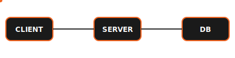
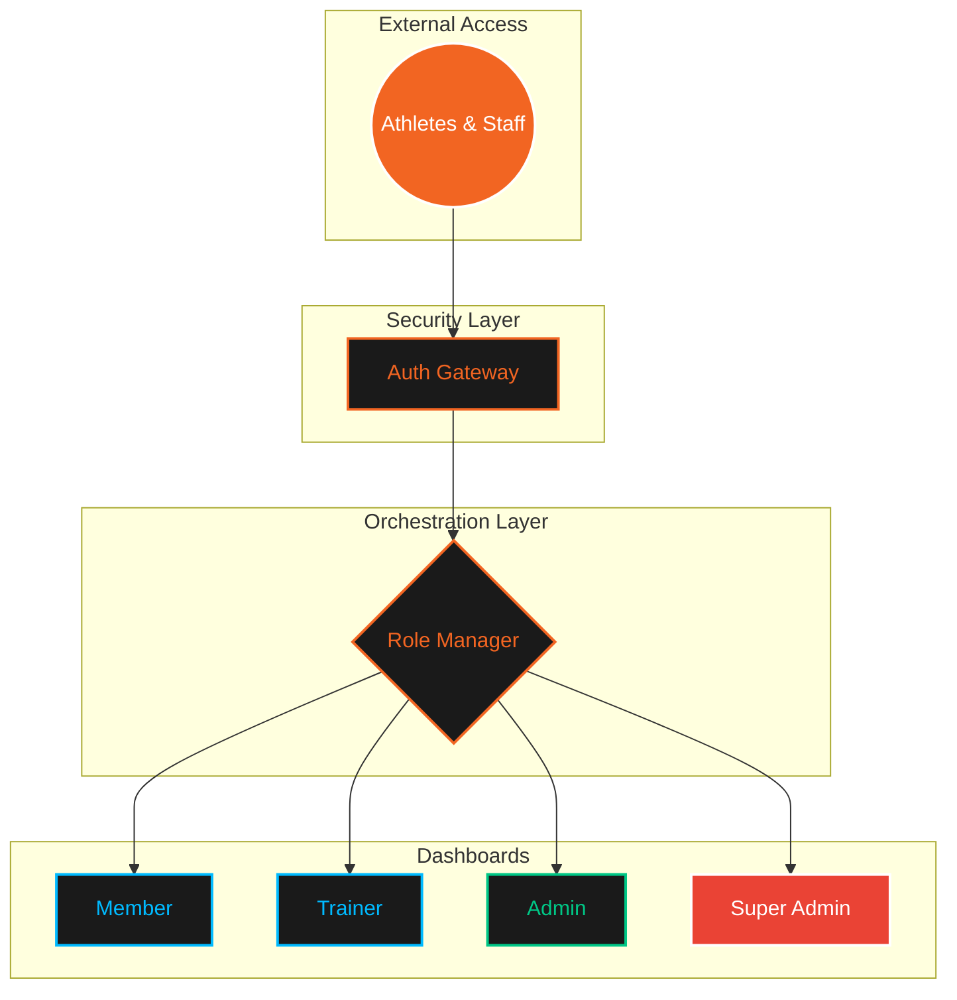
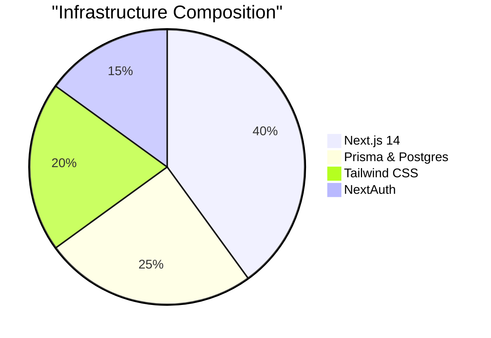

<div align="center">

# 🦅 EAGLE GYM PORTAL
### *Athletic Clarity • Strategic Control • Performance Integrity*

---

<p align="center">
  
</p>

[]()
[]()
[]()

---

</div>

## 🌀 SYSTEM PULSE (REAL-TIME ARCHITECTURE)

<p align="center">
  
</p>



---

## 🚀 COMMAND MODULES

<div align="center">

| Module | Access Level | Primary Objective | Intel |
| :--- | :---: | :--- | :---: |
| **Member** | `LEVEL 1` | Athletic Journey & Performance | [Explore](./docs/member.md) |
| **Trainer** | `LEVEL 2` | Squad Blueprint & Surveillance | [Explore](./docs/trainer.md) |
| **Admin** | `LEVEL 3` | Facility Ops & Revenue Intelligence | [Explore](./docs/admin.md) |
| **Super Admin** | `MASTER` | Ecosystem Governance & Global Logic | [Explore](./docs/super-admin.md) |

</div>

---

## 🛠️ TECH STACK COMMAND

<p align="center">
  
</p>



---

## 📋 CORE FEATURES

- 🦾 **Member Command**: Advanced session tracking with real-time rest orchestration.
- 🥗 **Nutrition Engine**: Precision macro-tracking and nutritionist-approved blueprints.
- 📈 **Admin Analytics**: Live revenue charts and attendance heatmaps.
- 🏢 **Multi-Branch Control**: Isolated data environments for global gym networks.
- 🔐 **RBAC Security**: Military-grade role-based access control.

---

## ⚡ RAPID DEPLOYMENT

```bash
# 1. Clone Intelligence
git clone https://github.com/Eternalcodertanishq3/Advanced-Gym-Portal.git

# 2. Synchronize Dependencies
npm install

# 3. Initialize Core
npx prisma generate && npx prisma db push

# 4. Launch Terminal
npm run dev
```

---

<div align="center">
  <p><b>AUTHORIZED PERSONNEL ONLY</b></p>
  <p>© 2024 EAGLE GYM PORTAL • ATHLETIC CLARITY</p>
</div>
