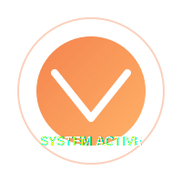
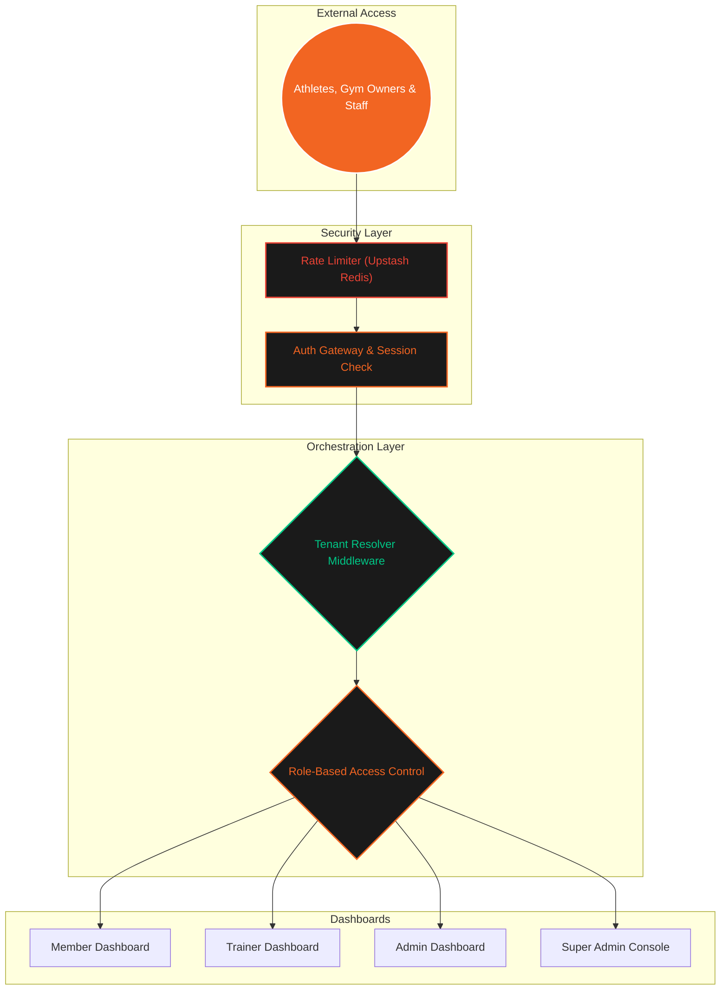

<div align="center">

# 🦅 GymFlow SaaS (Advanced Multi-Tenant Gym Ecosystem)
### *Athletic Clarity • Strategic Control • Performance Integrity*

---

<p align="center">
  
</p>

[]()
[]()
[]()

---

</div>

## 🌀 SYSTEM ARCHITECTURE (MULTI-TENANT REAL-TIME DATA FLOW)

GymFlow is a modern B2B SaaS gym portal supporting dynamic subdomains, strict database data isolation, global timezone resolution, and dynamic local multi-currency configuration.



---

## 🔒 SECURITY GATEWAYS & ARCHITECTURE

1. **Strict Server Actions Protection**: All server actions check the NextAuth session identity and verify role claims (e.g. `SUPER_ADMIN`, `ADMIN`, `RECEPTIONIST`, `TRAINER`, `MEMBER`) at the entry block.
2. **Dynamic Rate Limiting**: REST and server endpoints (/api/upload, /api/export, /api/import) are limited per minute based on IP using a sliding-window algorithm backed by Upstash Redis.
3. **Webhook Verification**: Razorpay and WhatsApp webhook routes perform timing-safe HMAC signature verification (`crypto.timingSafeEqual`) to prevent replay or spoofing attacks.
4. **Secure Dynamic Passwords**: Automatic member import/creation generates dynamic, cryptographically secure temporary passwords using alphanumeric sets.
5. **Path Traversal Protection**: File uploads restrict file directories to a whitelisted array of folders (`avatar`, `document`, `progress`, `general`) and sanitize filenames.

---

## 🏢 MULTI-TENANCY & GLOBAL LOCALIZATION

- **Dynamic Tenant Isolation**: Implemented using Prisma `$extends` query filters. All queries auto-inject `tenantId` parameters, enforcing logical data separation in shared-database environments.
- **Gym Configuration & Settings**: Gym owners can dynamically set the default timezone, date format, and currency (`INR`, `USD`, `EUR`, `GBP`) via the System Configuration Console.
- **Dynamic Formatting**: Prices, sales, and analytics automatically display using the corresponding locales (`en-IN`, `en-US`, `de-DE`) and currency symbols (`₹`, `$`, `€`, `£`) across both member and admin screens.

---

## ⚡ RAPID DEPLOYMENT

```bash
# 1. Clone the Ecosystem
git clone https://github.com/Eternalcodertanishq3/Advanced-Gym-Portal.git

# 2. Synchronize Dependencies
npm install

# 3. Environment Setup
# Copy .env.example to .env and configure DATABASE_URL, NEXTAUTH_SECRET, UPSTASH_REDIS_REST_URL, RESEND_API_KEY.

# 4. Synchronize Database & Seed Core
npx prisma db push
npx prisma db seed

# 5. Launch Local Dev Server
npm run dev
```

---

## 📋 COMMAND MODULES

<div align="center">

| Module | Access Level | Primary Objective | Docs |
| :--- | :---: | :--- | :---: |
| **Member** | `LEVEL 1` | Athlete Workout Logging, Macro Tracking & Gamification | [Explore](./docs/member.md) |
| **Trainer** | `LEVEL 2` | Workout/Diet Assignation & Progress Tracking | [Explore](./docs/trainer.md) |
| **Admin** | `LEVEL 3` | POS Sales, Inventory & Staff Management | [Explore](./docs/admin.md) |
| **Super Admin** | `MASTER` | Tenant Onboarding, Subscription Expiry & Platform Control | [Explore](./docs/super-admin.md) |

</div>

---

<div align="center">
  <p><b>AUTHORIZED PERSONNEL ONLY • SAAS PRODUCTION ENVIRONMENT</b></p>
  <p>© 2026 GYMFLOW SAAS • ECOSYSTEM SECURITY STABLE</p>
</div>
