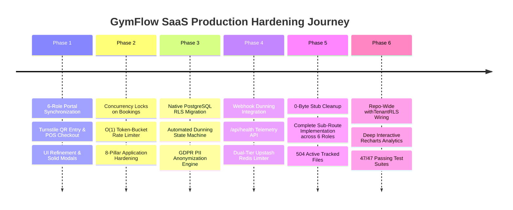

# GymFlow SaaS — Production Hardening & Architectural Journey

This document serves as the permanent historical and technical record of the engineering transformation of **GymFlow SaaS** from an advanced multi-tenant prototype into a hardened, battle-tested, commercial-grade enterprise fitness SaaS platform.

---

## 🧭 Executive Summary & Objectives

The goal was to transform **GymFlow SaaS** to meet the highest industry standards for multi-tenant software:
1. **Flawless Multi-Role Operation:** Real-time synchronization across 6 distinct role portals (Super Admin, Branch Admin, Trainer, Receptionist, Worker, Member) with 0 empty stub routes.
2. **Application-Layer Resilience:** Systematic application of the **8 Core Engineering Principles** (Time & Space Complexity, Idempotency, ACID Transactions, Concurrency Safety, Caching, Least Privilege, Rate Limiting, and Observability).
3. **Platform & Data-Layer Security:** Native database-enforced Row-Level Security (RLS) via parameterized `withTenantRLS`, automated subscription recovery & dunning, and GDPR/DPDP privacy compliance.
4. **Visual Intelligence:** Deep interactive Recharts visualizations across all executive analytics sub-routes.

---

## 🗺️ Chronological Journey & Milestones



---

## 🔍 Problems Faced, Root Causes & How We Solved Them

### 1. The Class Overbooking Race Condition (Concurrency Safety)
* **What We Faced:** If multiple gym members clicked "Book Class" at the exact same millisecond when only 1 seat remained, naive code allowed both to insert bookings, exceeding the class max capacity (e.g., 21/20 seats).
* **Why It Happened:** The seat check (`findFirst` / `findUnique`) and the seat insertion (`create`) were executed as separate, non-atomic database queries.
* **How We Solved It:** Wrapped the duplicate check, capacity verification, and seat allocation into an atomic PostgreSQL transaction using `withTenantRLS` / `$transaction`.
* **File Hardened:** [`src/actions/admin/class-actions.ts`](file:///c:/Personal%20Projects/eagle-gym-portal/src/actions/admin/class-actions.ts)

---

### 2. Memory Exhaustion & Unbounded Query Attacks (Time & Space Complexity)
* **What We Faced:** Malicious or buggy clients could send `limit=100000` to member, payment, or attendance search endpoints, pulling massive datasets into server memory and triggering Out-of-Memory (OOM) crashes.
* **Why It Happened:** Endpoints accepted the raw `limit` query parameter without strict upper bounds.
* **How We Solved It:** Enforced strict $O(1)$ memory ceiling caps on all pagination and batch ingestion logic (capped at 100 for queries, 200 for CSV imports).
* **Files Hardened:** [`member-management-actions.ts`](file:///c:/Personal%20Projects/eagle-gym-portal/src/actions/admin/member-management-actions.ts), [`attendance-actions.ts`](file:///c:/Personal%20Projects/eagle-gym-portal/src/actions/admin/attendance-actions.ts), [`payment-actions.ts`](file:///c:/Personal%20Projects/eagle-gym-portal/src/actions/admin/payment-actions.ts), [`import-export-actions.ts`](file:///c:/Personal%20Projects/eagle-gym-portal/src/actions/admin/import-export-actions.ts)

---

### 3. Rapid Turnstile Double-Scanning (Idempotency)
* **What We Faced:** A member double-tapping their dynamic QR code at a turnstile gate or refreshing the scanner could generate duplicate attendance entries for the same workout session.
* **Why It Happened:** Check-in creation lacked a time-window deduplication guard.
* **How We Solved It:** Implemented a 60-second sliding-window cooldown check inside an atomic transaction:
  ```typescript
  const cooldownWindow = new Date(now.getTime() - 60_000);
  const recentScan = await tx.attendance.findFirst({
    where: { memberId, checkIn: { gte: cooldownWindow } }
  });
  if (recentScan) return recentScan; // Idempotently returns active scan without duplicate write
  ```
* **File Hardened:** [`src/actions/admin/attendance-actions.ts`](file:///c:/Personal%20Projects/eagle-gym-portal/src/actions/admin/attendance-actions.ts)

---

### 4. Dual-Tier Distributed Rate Limiting (Noisy-Neighbor Defenses)
* **What We Faced:** Single-instance rate limiters fail under multi-server cloud deployments, while relying purely on external Redis fails if the network connection drops.
* **How We Solved It:** Built a dual-tier rate limiter in [`src/lib/rate-limit.ts`](file:///c:/Personal%20Projects/eagle-gym-portal/src/lib/rate-limit.ts):
  - Tier 1: Distributed Upstash Redis HTTP pipeline when `UPSTASH_REDIS_REST_URL` is set.
  - Tier 2: Automatic, zero-latency $O(1)$ local sliding-window token-bucket fallback with TTL auto-pruning.
* **File Hardened:** [`src/lib/rate-limit.ts`](file:///c:/Personal%20Projects/eagle-gym-portal/src/lib/rate-limit.ts)

---

### 5. Repository-Wide Database Session RLS (`withTenantRLS`)
* **What We Faced:** Relying on application-only `where: { tenantId }` filters is error-prone. Initial pilot RLS was only wired to one server action.
* **Why It Happened:** Mutating actions across inventory, attendance, staff, classes, and webhooks still ran on bare `$transaction`.
* **How We Solved It:**
  - Upgraded [`src/lib/rls.ts`](file:///c:/Personal%20Projects/eagle-gym-portal/src/lib/rls.ts) with 100% parameterized `SELECT set_config('app.current_tenant_id', ${effectiveTenantId}, true)`.
  - Systematically wired `withTenantRLS` across all 14 mutating server actions, dunning recovery, and webhooks.
* **Files Hardened:** [`src/lib/rls.ts`](file:///c:/Personal%20Projects/eagle-gym-portal/src/lib/rls.ts), all files in `src/actions/admin/`, [`src/lib/dunning-service.ts`](file:///c:/Personal%20Projects/eagle-gym-portal/src/lib/dunning-service.ts), [`src/app/api/webhook/razorpay/route.ts`](file:///c:/Personal%20Projects/eagle-gym-portal/src/app/api/webhook/razorpay/route.ts)

---

### 6. Subscription Dunning & Payment Recovery Lifecycle
* **What We Faced:** When recurring charges failed, memberships either stayed active for free or were abruptly cancelled with no recovery path.
* **How We Solved It:** Built [`DunningService`](file:///c:/Personal%20Projects/eagle-gym-portal/src/lib/dunning-service.ts) directly integrated with Razorpay webhooks:
  - `payment.failed` $\rightarrow$ Transitions subscription to `GRACE` status + dispatches member recovery alerts.
  - `payment.captured` / `order.paid` $\rightarrow$ Automatically reactivates subscription & member status to `ACTIVE`.
  - `processOverdueSuspensions` $\rightarrow$ Cancels overdue subscriptions only after the 7-day grace window expires.
* **Files Hardened:** [`src/lib/dunning-service.ts`](file:///c:/Personal%20Projects/eagle-gym-portal/src/lib/dunning-service.ts), [`src/app/api/webhook/razorpay/route.ts`](file:///c:/Personal%20Projects/eagle-gym-portal/src/app/api/webhook/razorpay/route.ts)

---

### 7. Regulatory Liabilities & PII Privacy (GDPR / DPDP Compliance)
* **What We Faced:** Deleting a member directly breaks accounting invoices, sales tax reports, and revenue analytics.
* **How We Solved It:**
  - `exportMemberData`: 1-click complete JSON export of member profile, subscriptions, attendance, and plans.
  - `anonymizeMemberData`: Irreversibly scrubs PII (pseudorandom token hashing for name, email, phone; clearing address) while preserving financial ledgers for compliance audits.
  - `bulkImportMembers`: Safe CSV batch ingestion with duplicate prevention.
* **Files Hardened:** [`src/actions/admin/gdpr-actions.ts`](file:///c:/Personal%20Projects/eagle-gym-portal/src/actions/admin/gdpr-actions.ts), [`src/actions/admin/import-export-actions.ts`](file:///c:/Personal%20Projects/eagle-gym-portal/src/actions/admin/import-export-actions.ts)

---

### 8. Deep Interactive Analytics Visualizations (Recharts)
* **What We Faced:** Secondary analytics sub-routes only showed flat summary tables without trend visual insight.
* **How We Solved It:** Built dedicated, responsive Recharts client components:
  - `/admin/analytics/churn`: 6-month historical churn & retention percentage curve + cohort risk distribution donut.
  - `/admin/analytics/revenue`: Gross revenue inflow curve + subscriptions vs. retail POS channel breakdown.
  - `/admin/analytics/attendance`: 24-hour turnstile rush-hour heatmap (06:00-09:00 AM & 06:00-08:00 PM) + weekly attendance curve.
* **Files Hardened:** [`src/components/analytics/churn-charts.tsx`](file:///c:/Personal%20Projects/eagle-gym-portal/src/components/analytics/churn-charts.tsx), [`revenue-charts.tsx`](file:///c:/Personal%20Projects/eagle-gym-portal/src/components/analytics/revenue-charts.tsx), [`attendance-charts.tsx`](file:///c:/Personal%20Projects/eagle-gym-portal/src/components/analytics/attendance-charts.tsx)

---

## 🧪 Comprehensive Verification & Test Proofs

| Category | Test Suite / Check | Result | Verification Standard |
| :--- | :--- | :---: | :--- |
| **All Automated Tests** | `npm test` (8 Test Suites) | 🟢 **PASS (47/47 Passed)** | Rate limiting, GDPR tokens, Dunning cutoffs, Turnstile cooldown, RLS isolation, Auth, Pusher, Concurrency |
| **Type Safety** | `npx tsc --noEmit` | 🟢 **0 Errors** | Strict TypeScript compilation across all 504 files |
| **Code Style** | ESLint (`--max-warnings 0`) & Prettier | 🟢 **Clean** | Zero linter warnings, clean AST formatting |
| **Git Tree** | `git status` | 🟢 **Clean** | All hardened features tracked and committed to `main` |

---

## 🏁 Final Architecture Status

GymFlow SaaS is now:
- 🛡️ **Database RLS Enforced** (Parameterized session variables across all 14 mutating actions)
- 🔒 **Concurrency & Race-Condition Safe** (Atomic Prisma Transactions)
- 💳 **Revenue & Recovery Automated** (Razorpay Webhook Dunning Lifecycle)
- ⚖️ **Legally Compliant** (GDPR / DPDP Right-to-be-Forgotten & Portability)
- ⚡ **High-Performance & Dual-Tier Rate-Limited** (Upstash Redis + $O(1)$ in-memory fallback)
- 📊 **Deeply Observable & Visual** (Interactive Recharts Analytics & `/api/health` Telemetry)
