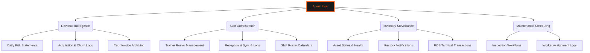
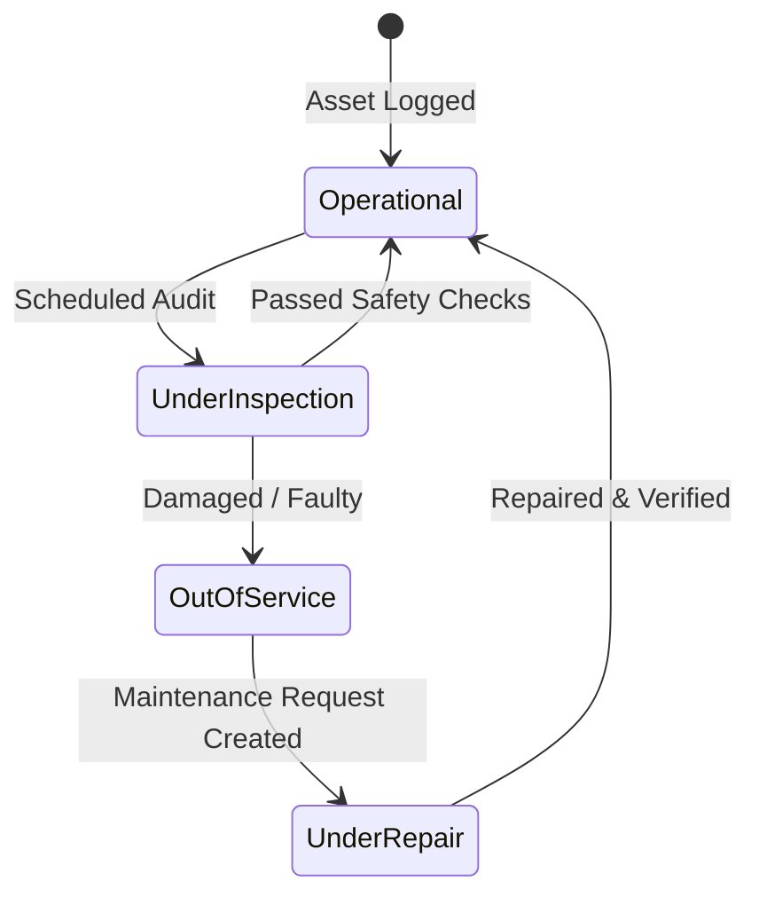
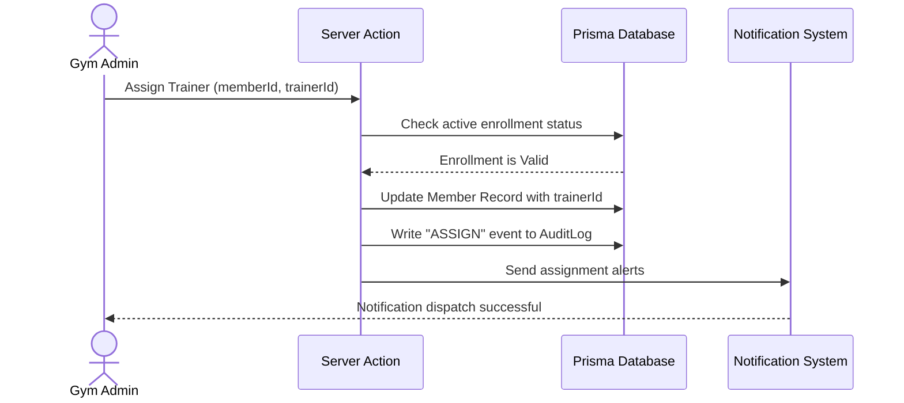
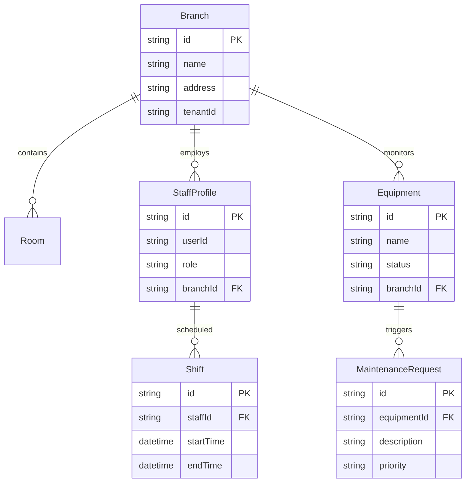

# 🦅 ADMIN OPERATIONS CENTER
### *Facility Orchestration • Financial Intelligence • Staff Management*

---

```
   GYMFLOW SaaS SYSTEM MODULE: ADMIN CONTROL
   ===========================================
   [AUTHORIZATION] : ADMIN (LEVEL 3) / SUPER-ADMIN (MASTER)
   [COMPLIANCE]    : SOC2 TYPE II AUDIT STABLE
   ===========================================
```

---

## 📖 TABLE OF CONTENTS
1. [Administrative Architecture](#1-administrative-architecture)
2. [Revenue & Billing Command](#2-revenue--billing-command)
3. [Personnel & Staff Management](#3-personnel--staff-management)
4. [Inventory & POS Asset Integrity](#4-inventory--pos-asset-integrity)
5. [Equipment Maintenance Schedules](#5-equipment-maintenance-schedules)
6. [Operational Workflows & Sequences](#6-operational-workflows--sequences)
7. [Database Schema & ER Relationships](#7-database-schema--er-relationships)
8. [Troubleshooting & Support Actions](#8-troubleshooting--support-actions)

---

## 1. ADMINISTRATIVE ARCHITECTURE

The Admin Module provides Gym Administrators with the tools necessary to manage a physical branch or branch network. It serves as the bridge between general staff operations and master SaaS controls.



Admins coordinate gym activities, ensure billing systems stay in sync, manage receptionist kiosk operations, and track staff schedules.

---

## 2. REVENUE & BILLING COMMAND

Admins monitor gym revenue streams, subscription statuses, invoice generation, and tax compliance.

### 2.1 Billing Cycles and Dashboard Tracking
All member transactions are tracked on the Billing dashboard. 

```
+-----------------------------------------------------------------+
|                      Revenue Dashboard                          |
+----------------------+-------------------+----------------------+
| Total MRR: $12,450   | Active Plans: 245 | Growth Rate: +4.2%   |
+----------------------+-------------------+----------------------+
| Sales Volume: $2,800 | Failed Plans: 3   | Tax Logged: $480     |
+----------------------+-------------------+----------------------+
```

The system automatically checks membership statuses:
* **Active**: Member has an active subscription plan and valid payment logs. Barcode scans at receptionist kiosks grant access.
* **Pending**: Membership has been created but payment is unconfirmed.
* **Failed**: A renewal payment failed. Access is blocked, and the system starts recovery attempts.
* **Inactive**: Subscription is expired or has been cancelled by the user.

### 2.2 Financial Invoicing and Tax Mappings
When a payment succeeds, the system generates a PDF invoice containing:
1. The tenant's tax details (GSTIN/VAT number).
2. The customer's registered profile details.
3. Itemized billing charges and transaction IDs.
4. Auto-calculated local taxes based on regional settings.

These invoices are stored in the database for auditing purposes.

---

## 3. PERSONNEL & STAFF MANAGEMENT

The Admin Module manages permissions and shifts for receptionist staff, trainers, and maintenance workers.

### 3.1 Role Governance Matrix
The system enforces strict role-based access controls:

| Role | Access Level | Primary Scope | Permitted Actions |
| :--- | :---: | :--- | :--- |
| **Member** | `LEVEL 1` | Athlete Portal | Workout logging, macro tracking, billing retries. |
| **Trainer** | `LEVEL 2` | Client Lists | Exercise assignment, diet planner, macro calculation. |
| **Receptionist** | `LEVEL 2` | Front Desk | Scan check-ins, register walk-ins, process POS sales. |
| **Admin** | `LEVEL 3` | Branch Dashboard | Staff scheduling, inventory management, plan adjustments. |
| **Super Admin** | `MASTER` | System Console | Tenant onboarding, global configurations, audit logs. |

### 3.2 Staff Roster Scheduling
Admins coordinate floor coverage, shift assignments, and payroll tracking.

```mermaid
gantt
    title Typical Facility Shift Roster
    dateFormat  HH:mm
    axisFormat %H:%M
    section Morning Shift
    Receptionist A  :active, 06:00, 14:00
    Trainer A       :active, 06:00, 14:00
    section Afternoon Shift
    Receptionist B  :active, 14:00, 22:00
    Trainer B       :active, 14:00, 22:00
    section Maintenance
    Worker Roster   :done, 12:00, 15:00
```



Shift schedules prevent overlaps and ensure floor coverage during peak hours.

---

## 4. INVENTORY & POS ASSET INTEGRITY

Admins track gym inventory and manage point-of-sale (POS) product transactions.

### 4.1 Stock Control Systems
Products (supplements, merchandise, apparel) are logged in the database.

```
+-----------------------------------------------------------------+
|                       Inventory Control                         |
+-------------------+-----------------+---------------+-----------+
| Product Name      | Current Stock   | Reorder Level | Status    |
+-------------------+-----------------+---------------+-----------+
| Whey Protein 1kg  | 45 units        | 10 units      | STABLE    |
| Pre-Workout Blend | 8 units         | 10 units      | LOW STOCK |
| Gym Shaker Bottle | 120 units       | 20 units      | STABLE    |
+-------------------+-----------------+---------------+-----------+
```

When stock falls below the configured reorder level, the system triggers alerts on the admin dashboard.

### 4.2 Point-of-Sale (POS) Checkouts
Receptionists process product sales using the built-in POS interface. The system updates stock levels and generates a payment transaction log automatically upon checkout.

---

## 5. EQUIPMENT MAINTENANCE SCHEDULES

To maintain safety standards, Admins schedule inspections for all workout equipment.

### 5.1 Machine Inspection Workflows
Every asset (treadmill, power rack, cable machine) is logged in the system.



Workers use the mobile interface to update equipment statuses, flag broken machinery, and request repairs.

---

## 6. OPERATIONAL WORKFLOWS & SEQUENCES

### 6.1 Trainer Assignment Process
This sequence diagram shows the step-by-step process of assigning a trainer to a new member:



This ensures that the member is notified of their trainer assignment immediately.

---

## 7. DATABASE SCHEMA & ER RELATIONSHIPS

The following entity-relationship diagram shows how administrative controls map to database tables:



This relational layout enforces multi-tenant isolation, keeping branch and staff data secure.

---

## 8. TROUBLESHOOTING & SUPPORT ACTIONS

### 8.1 Resolution Procedures for Common Issues

#### Issue: Low Stock Alert Fails to Trigger
* **Possible Cause**: Reorder level is set to zero, or database update events are pending.
* **Resolution**: Verify reorder thresholds on the Inventory Settings page and ensure background jobs are running.

#### Issue: Shift Schedule Overlap Warning
* **Possible Cause**: Duplicate shifts assigned to a single staff member in the same timeframe.
* **Resolution**: Use the Roster Calendar to resolve conflicts before saving schedules.

#### Issue: Missing Invoice PDFs
* **Possible Cause**: Payment gateway callback was delayed or unconfirmed.
* **Resolution**: Verify the transaction status in the Razorpay dashboard and manually trigger invoice generation.

---

<div align="center">
  <p><b>GymFlow SaaS Portal • Admin Operations Guide</b></p>
  <p>© 2026 GYMFLOW SAAS. ALL RIGHTS RESERVED.</p>
</div>
