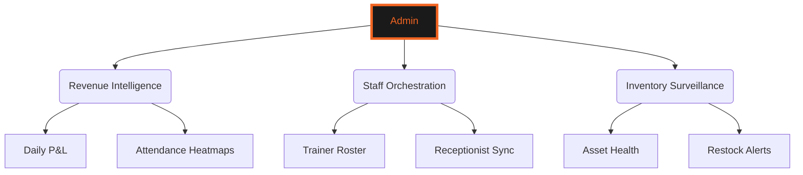

# 🦅 ADMIN OPERATIONS CENTER
### *Facility Orchestration • Financial Intelligence • Staff Management*

---

---

## 🌀 ADMINISTRATIVE ARCHITECTURE

---

## 🚀 CORE SYSTEMS

### 💰 REVENUE COMMAND `(admin/analytics)`
- **Financial Streams**: Real-time tracking of subscriptions and sales.
- **Growth Audits**: Monitoring acquisition vs. churn metrics.
- **VAT Compliance**: automated generation of financial statements.

### 👥 PERSONNEL COMMAND `(admin/staff)`
- **Role Governance**: managing permissions and access for all staff.
- **Efficiency Reports**: auditing trainer performance and member satisfaction.
- **Scheduling**: coordinating floor coverage across all shifts.

### 📦 ASSET INTEGRITY `(admin/inventory)`
- **Machine Health**: maintenance scheduling for all gym equipment.
- **Stock Control**: real-time inventory for supplements and apparel.
- **Vendor Management**: streamlined procurement and restock cycles.

---

## 📊 FACILITY UTILIZATION

```mermaid
gantt
    title Typical Facility Traffic
    dateFormat  HH:mm
    axisFormat %H:%M
    section Peak
    Morning Rush     :done, 06:00, 09:00
    Evening Surge    :active, 17:00, 21:00
    section Maintenance
    Floor Cleaning   :12:00, 14:00
```

---

  
<b>EFFICIENCY IN MOTION</b>

  
Authorized for Facility Management Only

