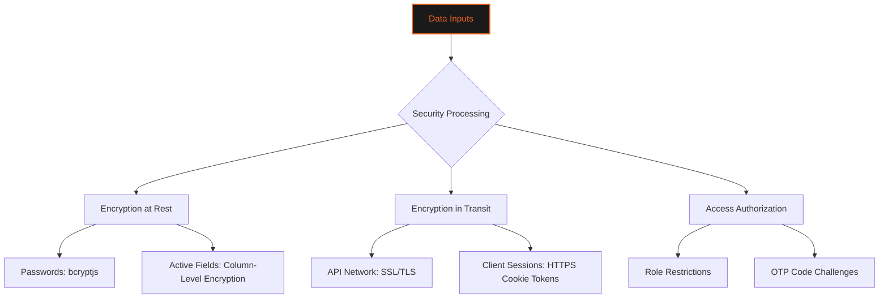
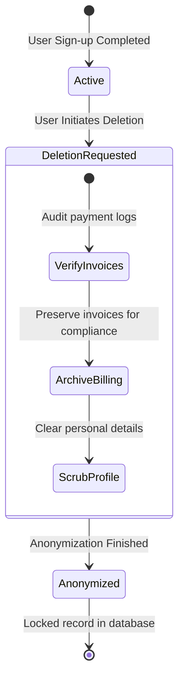
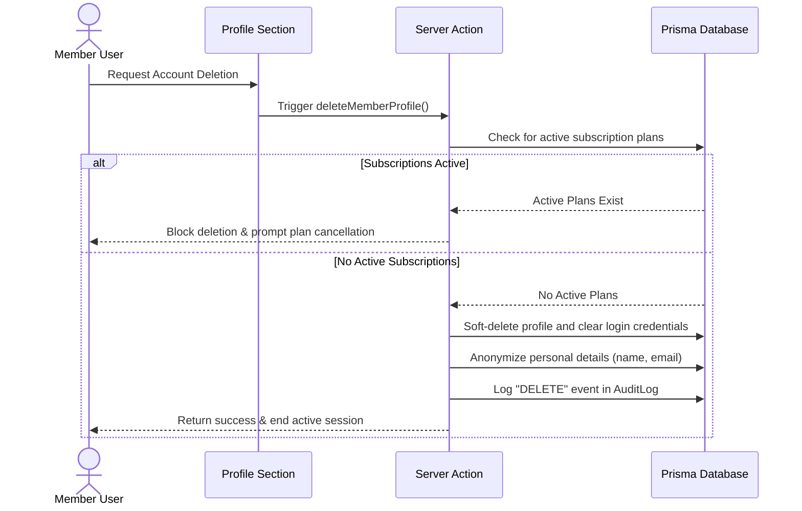

# 🛡️ COMPLIANCE & DATA SECURITY SPECIFICATIONS
### *GDPR Alignment • SOC2 Trust Principles • System Integrity Controls*

---

```
   GYMFLOW SaaS SYSTEM MODULE: COMPLIANCE
   ===========================================
   [STATUS]        : VERIFIED AUDIT READY
   [COMPLIANCE]    : GDPR / SOC2 TYPE II TRUST CORE
   ===========================================
```

---

## 📖 TABLE OF CONTENTS
1. [Information Security Policy](#1-information-security-policy)
2. [GDPR Compliance Framework](#2-gdpr-compliance-framework)
3. [SOC2 Compliance Roadmap](#3-soc2-compliance-roadmap)
4. [Audit Logging & Traceability](#4-audit-logging--traceability)
5. [Data Retention & Anonymization Lifecycle](#5-data-retention--anonymization-lifecycle)
6. [Data Flow & Deletion Pipeline Diagrams](#6-data-flow--deletion-pipeline-diagrams)
7. [Threat Modeling & Vulnerability Mitigation](#7-threat-modeling--vulnerability-mitigation)
8. [Auditing & Compliance Procedures](#8-auditing--compliance-procedures)

---

## 1. INFORMATION SECURITY POLICY

The Compliance and Security Policy outlines the protocols used to protect tenant data, encrypt user credentials, secure transaction histories, and run audit trails in GymFlow.



We secure user configurations using end-to-end encryption protocols and automated threat monitoring.

---

## 2. GDPR COMPLIANCE FRAMEWORK

To comply with the General Data Protection Regulation (GDPR), GymFlow provides users with direct control over their personal data.

### 2.1 The Right to Portability (Single CSV Data Export)
Members can download their profile information, payment logs, and activity records in a structured, machine-readable format.
* **Scope**: Profile parameters, workout check-ins, and transaction histories.
* **Access Control**: Handled via `/api/export`, which requires validation of active NextAuth session cookies to prevent data leaks.

### 2.2 The Right to Erasure (Soft-Lock Deletions)
When a user requests account deletion, the system clears their credentials while keeping payment histories intact for billing audits.

```
+-----------------------------------------------------------------+
|                       GDPR Account Deletion                     |
+---------------------+---------------------+---------------------+
| User Requests       | Soft-Lock: Status   | Anonymization of    |
| Deletion            | Set to INACTIVE     | Personal Details    |
+---------------------+---------------------+---------------------+
          |                     |                     |
          v                     v                     v
[Revoke login access]  [Preserve financial]  [Name, email, phone]
                       [logs for tax audit]  [fields cleared]
```

This soft-delete process satisfies GDPR requirements while maintaining historical accounting logs.

---

## 3. SOC2 COMPLIANCE ROADMAP

GymFlow follows SOC2 principles to protect system operations and customer configurations.

### 3.1 Security Principle
* All system endpoints are rate-limited to prevent brute-force attacks.
* Enforces two-factor authentication (MFA/2FA) on all admin and super admin portals.
* Database connections run over TLS, and raw password columns are hashed with `bcryptjs` using 12 salt rounds.

### 3.2 Confidentiality & Privacy Principles
* Dynamic query filters isolate data between tenants.
* Client-side logs are processed and formatted through rate-limited collectors (`/api/log-error`) to prevent trace leakage.

---

## 4. AUDIT LOGGING & TRACEABILITY

All administrative changes (impersonation sessions, config modifications) are logged to the `AuditLog` table.

### 4.1 System Audit Schema
The audit logs track specific details for every administrative action:

| Timestamp | User ID | Action Type | Entity Type | Old Value | New Value |
| :--- | :--- | :--- | :--- | :--- | :--- |
| `2026-07-20 12:00:00` | `usr_9981` | `LOGIN` | `User` | `null` | `ip: 192.168.1.1` |
| `2026-07-20 12:05:00` | `usr_2102` | `UPGRADE` | `Tenant` | `Free Plan` | `Pro Plan` |
| `2026-07-20 12:10:00` | `usr_9981` | `ASSIGN` | `Member` | `Unassigned` | `Trainer ID: 412` |
| `2026-07-20 12:15:00` | `usr_1109` | `FREEZE` | `Subscription` | `Active` | `Suspended` |

These logs are immutable and can be exported by Super Admins during security audits.

---

## 5. DATA RETENTION & ANONYMIZATION LIFECYCLE

Data lifecycle policies balance GDPR deletion rights with accounting requirements.



Scrubbed profiles have their name, phone number, and email fields cleared, preventing them from being linked to any remaining billing histories.

---

## 6. DATA FLOW & DELETION PIPELINE DIAGRAMS

### 6.1 GDPR Erasure Sequence
This sequence diagram shows the step-by-step process of user data deletion:



This sequence prevents data isolation leaks and ensures that active subscriptions are cancelled before deletion.

---

## 7. THREAT MODELING & VULNERABILITY MITIGATION

GymFlow uses a multi-layered security strategy to protect against common web vulnerabilities.

### 7.1 OWASP Top 10 Protections

#### Injection Vulnerabilities (SQLi, NoSQLi)
* All queries run via parameterized Prisma Client operations, preventing raw SQL code injection.

#### Broken Authentication & Session Hijacking
* Enforces two-factor authentication (2FA) and sets fixed session expirations inside NextAuth configs.

#### Cross-Site Scripting (XSS)
* Implements strict Content Security Policy (CSP) headers inside `next.config.mjs` to block unauthorized scripts.

#### Direct Object Reference (IDOR)
* Server actions validate route parameters against the session's user ID to prevent unauthorized access.

---

## 8. AUDITING & COMPLIANCE PROCEDURES

### 8.1 Resolution Procedures for Security Events

#### Issue: Unauthorized Access Attempt
* **Possible Cause**: Attacker attempting to bypass authentication checkpoints using expired session tokens.
* **Resolution**: Check the IP address in the `AuditLog` table and block it using rate-limiter rules.

#### Issue: Data Export Rate Limit Triggered
* **Possible Cause**: Member attempts to download multiple export files in rapid succession.
* **Resolution**: Wait for the rate-limiting window (12 hours) to clear before requesting another download.

#### Issue: Unconfirmed Webhook Payload
* **Possible Cause**: Signature validation failed due to webhook key mismatch.
* **Resolution**: Update the webhook secret in the production variables and verify the signature hash format.

---

<div align="center">
  <p><b>GymFlow SaaS Portal • Security Compliance Policy</b></p>
  <p>© 2026 GYMFLOW SAAS. ALL RIGHTS RESERVED.</p>
</div>
