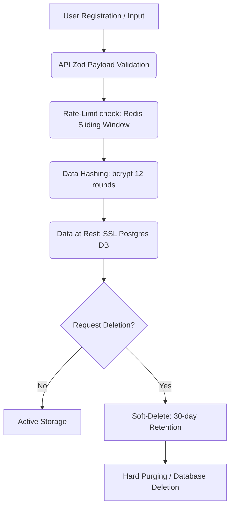
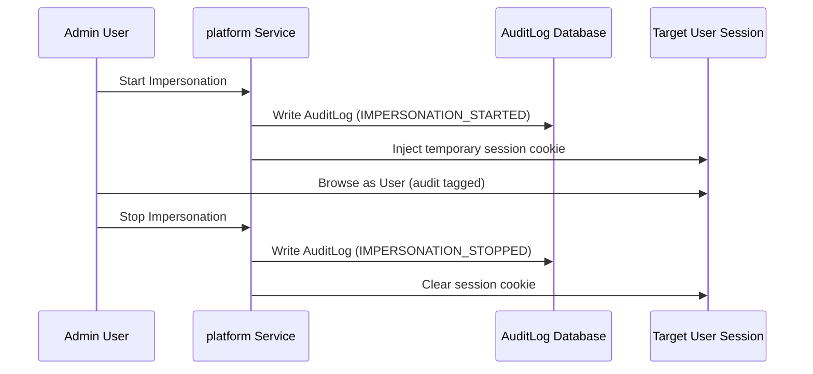

# SaaS Compliance & Security Controls Policy

This policy documents the security controls, data governance, audit logging, and compliance architecture implemented in **GymFlow SaaS** to align with **SOC2 (Trust Services Criteria)**, **GDPR**, and **ISO27001** guidelines.

---

## 1. Data Governance & Lifecycle Flow

We enforce a strict data minimization, encryption, rate-limiting, and deletion flow for all tenant and user data:

### 1.1 Data Collection & Residency
* **Residency**: All user data, backups, and configurations are stored in secure cloud database clusters (e.g. AWS RDS or Supabase PostgreSQL) running inside isolated VPC networks with SSL-only connection rules.
* **Minimization**: Only essential inputs (names, email, phone, branch IDs) are collected during registration.

### 1.2 Data Portability & Deletion
* **Data Export**: Gym owners can export all member profiles, payments, and histories in structured CSV or JSON formats directly from the dashboard.
* **Right to be Forgotten (GDPR)**: Users requesting deletion undergo a soft-delete status update (`deletedAt` field). Standard data retention cycles maintain this data in backup snapshots for a maximum of 30 days before full hard-purging.

---

## 2. Platform Audit Controls

All core administrative actions, receptionist check-ins, payment transactions, and impersonation sessions generate strict audit trails.

### 2.1 User Impersonation Audits

* **Administrative Impersonation**: Starting or stopping a member impersonation session triggers an automatic `AuditLog` entry detailing:
  * Initiating Admin User ID.
  * Target User ID.
  * Exact timestamp and IP address.
  * System event code (`IMPERSONATION_START` / `IMPERSONATION_STOP`).
* **Traceability**: Impersonation cookies are set as HTTP-only, secure, and expire immediately when the administrator closes the window or clicks "Stop Impersonating".

---

## 3. SOC2 Security Controls Checklist

We maintain readiness across key security criteria:

| Control Area | Implementation Status | System Verification |
| :--- | :--- | :--- |
| **Authentication** | Cryptographically signed JSON Web Tokens (JWT) using NextAuth. Password hashing via bcryptjs with 12 rounds. | Verified via auth middleware |
| **Rate Limiting** | sliding-window Redis rate limits configured on high-traffic endpoints (`/upload`, `/export`, `/import`). | Managed in `rate-limit.ts` |
| **API Sanitation** | All API route payloads and server actions undergo schema validation using Zod prior to database operations. | Managed in `validators.ts` |
| **Headers Protection** | Hardened CSP, X-Frame-Options, X-Content-Type-Options, and Permissions-Policy. | Configured in `next.config.mjs` |
| **Tenancy Isolation** | Queries filter by `tenantId` (gymId) at the database layer to prevent cross-tenant data leakage. | Verified in server actions |
