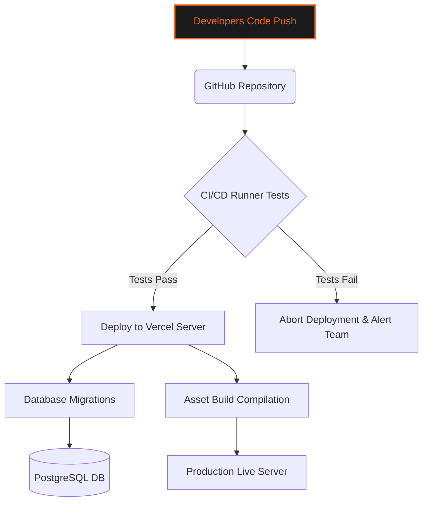
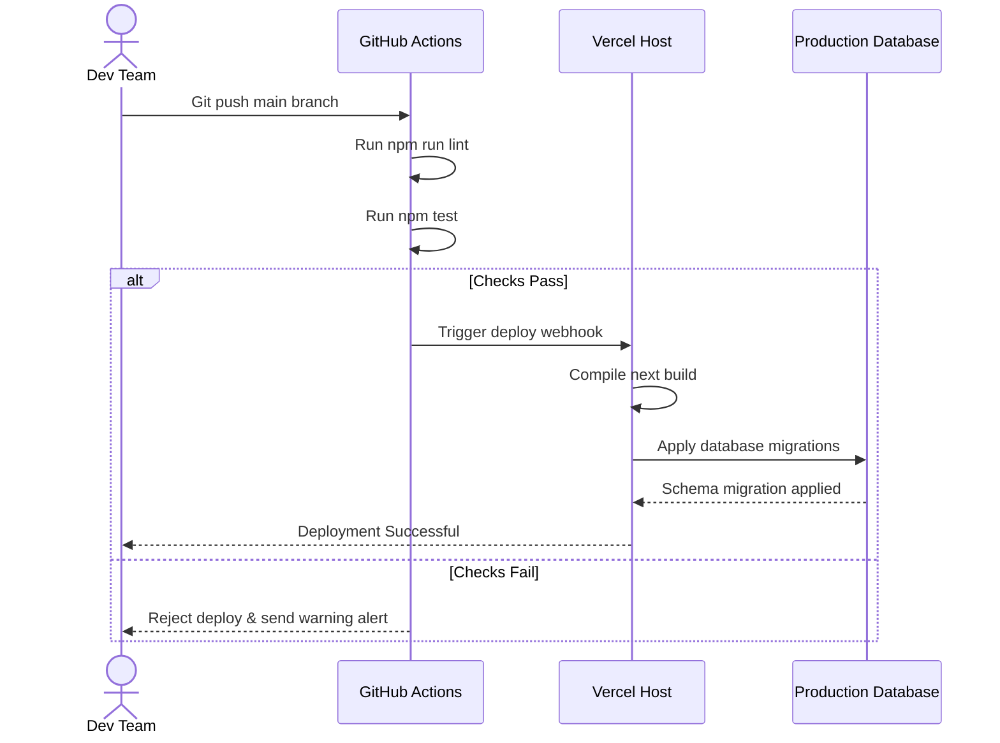

# ⚙️ DEVOPS & PRODUCTION DEPLOYMENT GUIDE
### *Server Provisioning • Database Pooling • CI/CD Pipelines*

---

```
   GYMFLOW SaaS SYSTEM MODULE: DEVOPS
   ===========================================
   [ENVIRONMENT]  : PRODUCTION / STAGING
   [INFRA CORE]   : VERCEL / POSTGRESQL / REDIS
   ===========================================
```

---

## 📖 TABLE OF CONTENTS
1. [Production Infrastructure Overview](#1-production-infrastructure-overview)
2. [Database Provisioning & Connection Pooling](#2-database-provisioning--connection-pooling)
3. [Rate Limiting & Redis Setup](#3-rate-limiting--redis-setup)
4. [Custom Domains & SSL/TLS Configuration](#4-custom-domains--ssl-tls-configuration)
5. [Continuous Integration & Delivery (CI/CD)](#5-continuous-integration--delivery-cicd)
6. [Ecosystem Deployment Pipeline Diagram](#6-ecosystem-deployment-pipeline-diagram)
7. [Environment Variable Configuration Matrix](#7-environment-variable-configuration-matrix)
8. [Troubleshooting & Infrastructure Recovery](#8-troubleshooting--infrastructure-recovery)

---

## 1. PRODUCTION INFRASTRUCTURE OVERVIEW

The DevOps and Infrastructure Guide covers server deployment, database pooling, custom domains, SSL certification, and CI/CD pipelines in GymFlow.



We deploy GymFlow using automated CI/CD runners to ensure security and code quality.

---

## 2. DATABASE PROVISIONING & CONNECTION POOLING

GymFlow uses PostgreSQL for relational data storage and Prisma Client ORM for query operations.

### 2.1 pgBouncer Connection Pooling
Serverless deployment environments (like Vercel) open new database connections on every request, which can quickly exhaust the connection pool. We use PgBouncer to manage and reuse active connections.

```
+-----------------------------------------------------------------+
|                    Database Pooling Architecture                |
+---------------------+---------------------+---------------------+
| Next.js Serverless  | PgBouncer Connection| PostgreSQL DB       |
| Function Instances  | Manager Pool        | Server              |
+---------------------+---------------------+---------------------+
           |                     |                     |
           v                     v                     v
   [Spawns 50+ queries]  [Reuses 5 active]     [Maintains stable]
                         [connections]         [connection state]
```

This pooling strategy prevents database timeouts and maintains performance during peak traffic.

---

## 3. RATE LIMITING & REDIS SETUP

To protect API endpoints from brute-force attacks and abuse, GymFlow uses a Redis-backed sliding-window rate limiter.

### 3.1 Upstash Redis Configuration
We use Upstash Redis for serverless-compatible connection caching.
* **REST Connection**: Calls run over HTTP, avoiding persistent TCP connections and reducing connection overhead.
* **Rolling TTL Evictions**: Expired request logs are cleared automatically to keep Redis memory usage low.

---

## 4. CUSTOM DOMAINS & SSL/TLS CONFIGURATION

GymFlow supports custom domain routing, allowing gym owners to use their own domains for their branch portals.

### 4.1 DNS Configuration
To point a custom domain (e.g., `portal.gymname.com`) to GymFlow, configure the CNAME record:

| Host Name | Record Type | Target Domain | TTL |
| :--- | :--- | :--- | :--- |
| `portal` | `CNAME` | `cname.vercel-dns.com` | `3600` |
| `@` | `A` | `76.76.21.21` | `3600` |

### 4.2 Automated SSL/TLS Certificates
Vercel automatically provisions and renews SSL certificates (Let's Encrypt) for all custom domains when the DNS records are confirmed, ensuring secure HTTPS connections.

---

## 5. CONTINUOUS INTEGRATION & DELIVERY (CI/CD)

The CI/CD pipeline automates testing and deployment on code changes.

```mermaid
stateDiagram-v2
    [*] --> CodePushed : Commit pushed to branch
    CodePushed --> LintChecks : Run ESLint rules
    LintChecks --> UnitTests : Run Jest tests
    UnitTests --> BuildTests : Run Next.js build
    
    BuildTests -- Build Passed --> DeployStaging : Merge to main
    DeployStaging --> E2ETests : Run Playwright tests
    E2ETests -- Pass --> DeployProduction : Promote to production
    
    BuildTests -- Build Failed --> CancelDeploy : Block deployment
    E2ETests -- Fail --> CancelDeploy
```

This automated workflow prevents regression errors and maintains security in production.

---

## 6. ECOSYSTEM DEPLOYMENT PIPELINE DIAGRAM

This sequence diagram shows the automated build and deployment process:



---

## 7. ENVIRONMENT VARIABLE CONFIGURATION MATRIX

Configure these environment variables in your deployment settings:

| Variable Name | Required | Scope | Description |
| :--- | :---: | :--- | :--- |
| `DATABASE_URL` | Yes | Database Connection | Connection URL with pooling enabled. |
| `NEXTAUTH_SECRET` | Yes | Token Security | Cryptographic key used to encrypt cookie sessions. |
| `UPSTASH_REDIS_REST_URL`| Yes | Rate Limiting | Rest connection URL for Upstash Redis database. |
| `UPSTASH_REDIS_REST_TOKEN`| Yes | Rate Limiting | Authentication token for Upstash Redis database. |
| `RESEND_API_KEY` | No | Email System | API key for Resend email dispatching. |
| `SMTP_HOST` | No | Email System | Hostname of the fallback SMTP server. |

---

## 8. TROUBLESHOOTING & INFRASTRUCTURE RECOVERY

### 8.1 Resolution Procedures for DevOps Incidents

#### Issue: Database Connection Limit Exceeded
* **Possible Cause**: Next.js serverless functions opening too many connections due to missing PgBouncer pooling parameters.
* **Resolution**: Verify that the connection URL includes `?pgbouncer=true` and adjust connection limits in the database settings.

#### Issue: Rate Limiter Blocking All Requests
* **Possible Cause**: Redis connection credentials are invalid or expired.
* **Resolution**: Check Redis credentials in the env variables, and verify connection status using the CLI.

#### Issue: SSL Certificate Provisioning Delayed
* **Possible Cause**: DNS changes are pending replication.
* **Resolution**: Verify CNAME settings using `dig` and request a certificate renewal in the Vercel console once DNS is propagated.

---

<div align="center">
  <p><b>GymFlow SaaS Portal • DevOps & Infrastructure Guide</b></p>
  <p>© 2026 GYMFLOW SAAS. ALL RIGHTS RESERVED.</p>
</div>
