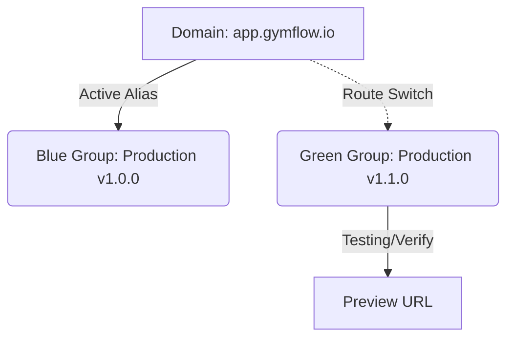

# SaaS DevOps Pipeline & Deployment Guide

This guide documents the automated CI/CD configurations, preview deployments, rollbacks, and progressive traffic routing strategies for **GymFlow SaaS**.

---

## 1. Automated CI/CD (GitHub Actions)

We have two automated workflows configured under `.github/workflows/`:

### 🧪 Integration Pipeline (`ci.yml`)
Runs on every `push` and `pull_request` to `main` and `develop` branches:
1. **Lint & Type Check**:
   * Evaluates ESLint constraints.
   * Runs TypeScript compile verification (`npx tsc --noEmit`).
   * Verifies Prettier format consistency.
2. **Build Validation**:
   * Validates production optimization and tree-shaking compilation (`npm run build`).
3. **Test Runner**:
   * Generates local Prisma Client.
   * Executes the full Jest unit and integration test suite (`npm test`).

### 🛡️ Dependency Security Scan (`security-scan.yml`)
* Automatically checks dependencies for CVE warnings using `npm audit --audit-level=high` on every codebase push.

---

## 2. Preview Deployments (Vercel)

Vercel integration is enabled for GymFlow SaaS, providing automatic **Preview Deployments** for every pull request:
1. **Isolated Preview Environments**: Every PR generates a unique, shareable URL (e.g. `https://eagle-gym-portal-git-feature-branch.vercel.app`).
2. **Clean State Isolation**: Previews run on independent Vercel edge instances, allowing designers, stakeholders, and developers to live-test feature additions without disrupting staging or production.

---

## 3. Automatic Rollbacks

To protect production uptime:
1. **Fail-Safe Compilation**: If a production build fails during the Next.js optimization phase on Vercel, the deploy is aborted, and the current active production build is preserved with **zero connection downtime**.
2. **Instant Manual Rollback**: If a regression bypasses CI testing and is deployed to production:
   * Go to your **Vercel Dashboard** -> **Deployments**.
   * Locate the last known healthy deployment.
   * Click the three dots icon next to it and select **Rollback**.
   * Vercel instantly routes root domain traffic back to the healthy build inside 1 second.

---

## 4. Blue-Green Deployments (High Traffic Strategy)

Once gym portal traffic grows significantly, you can implement a manual **Blue-Green Deployment** flow using Vercel DNS Aliasing to completely decouple deployments from live traffic:



### Execution Flow:
1. **Deploy Green Build**: Push your new production release candidate to a secondary staging branch (e.g., `production-green`). Vercel compiles and hosts it on a private preview URL.
2. **Smoke Test**: Perform final checks and integration testing on the live preview URL.
3. **Traffic Switch**: Re-assign your main domain alias (e.g. `app.gymflow.io` / custom subdomains) to the green deployment using the Vercel CLI or Dashboard:
   ```bash
   vercel alias set <green-deployment-url> app.gymflow.io
   ```
4. **Immediate Fallback**: If the green build experiences unexpected errors under load, instantly re-alias the main domain back to the Blue group (the previous build).
