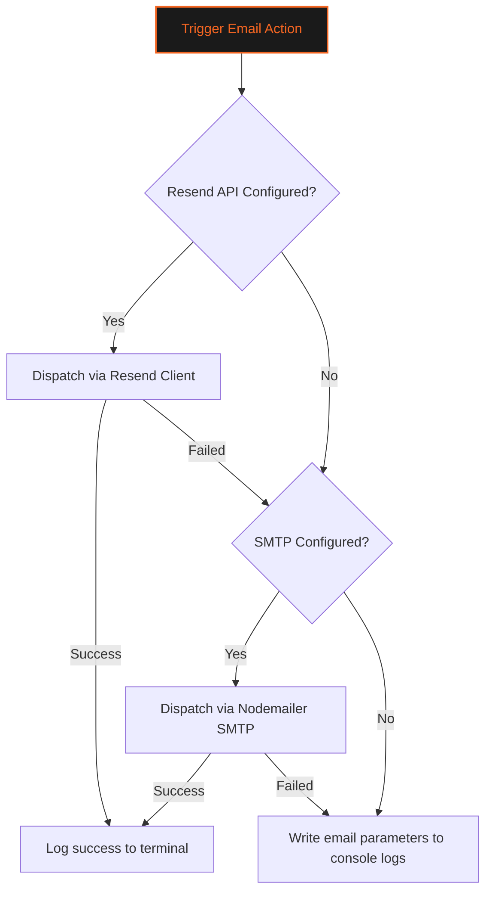
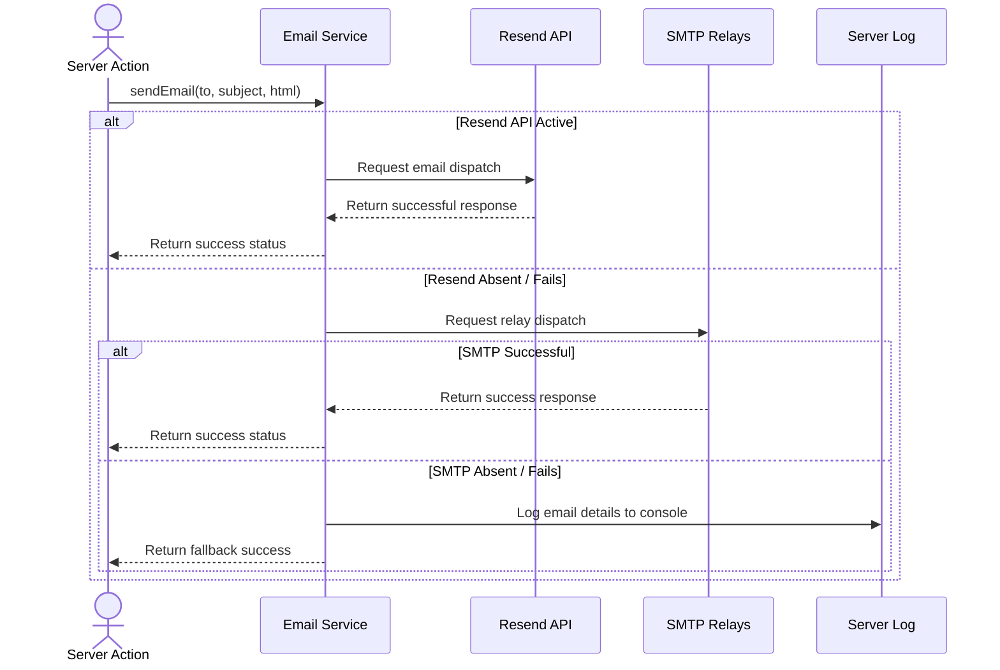

# 📧 EMAIL INTEGRATION & DELIVERABILITY GUIDE
### *Resend API • SMTP Relay Fallbacks • DNS Hardening*

---

```
   GYMFLOW SaaS SYSTEM MODULE: EMAIL ENGINE
   ===========================================
   [DELIVERY CORE] : RESEND API / NODEMAILER SMTP
   [SECURITY DNS]  : SPF / DKIM / DMARC ENABLED
   ===========================================
```

---

## 📖 TABLE OF CONTENTS
1. [Email Dispatch Architecture](#1-email-dispatch-architecture)
2. [Resend API Integration](#2-resend-api-integration)
3. [SMTP Fallback Configuration](#3-smtp-fallback-configuration)
4. [DNS Configuration & Authentication](#4-dns-configuration--authentication)
5. [Ecosystem Email Triggers Directory](#5-ecosystem-email-triggers-directory)
6. [Email Dispatch Logic Diagram](#6-email-dispatch-logic-diagram)
7. [Environment Variable Configuration](#7-environment-variable-configuration)
8. [Troubleshooting & Delivery Auditing](#8-troubleshooting--delivery-auditing)

---

## 1. EMAIL DISPATCH ARCHITECTURE

The Email Deliverability and Integration Guide covers the setup of the primary Resend API client, fallback SMTP relays, DNS security records, and transactional email templates in GymFlow.



We configure transactional emails with multiple fallbacks to ensure deliverability.

---

## 2. RESEND API INTEGRATION

GymFlow uses the Resend API as its primary email delivery service.
* **API Dispatch**: Next.js server actions send emails using the Resend client, reducing connection times compared to standard SMTP.
* **Dynamic Domain Names**: The system reads default email senders from the config table to match the workspace's branding.

---

## 3. SMTP FALLBACK CONFIGURATION

If the Resend API credentials are not configured, GymFlow uses Nodemailer to send emails through a fallback SMTP server.

```
+-----------------------------------------------------------------+
|                      Email Provider Hierarchy                   |
+---------------------+---------------------+---------------------+
| Tier 1: Resend API  | Tier 2: SMTP Relay  | Tier 3: Console Log |
| (Primary Option)    | (Nodemailer Fallback)| (Local Dev Backup)  |
+---------------------+---------------------+---------------------+
           |                     |                     |
           v                     v                     v
[Uses fast HTTP calls] [Relays via standard] [Outputs to terminal]
                       [SMTP configurations] [to prevent blocking]
```

This multi-tiered configuration prevents application errors if mail keys are missing during local development.

---

## 4. DNS CONFIGURATION & AUTHENTICATION

To prevent emails from being flagged as spam, configure the SPF, DKIM, and DMARC records on your domain.

### 4.1 Sender Policy Framework (SPF)
Add an TXT record to authorize the email servers to send mail for your domain:

```
v=spf1 include:amazonses.com include:resend.com ~all
```

### 4.2 DomainKeys Identified Mail (DKIM)
Add the DKIM public keys generated by your email provider as TXT records to authenticate messages.

### 4.3 DMARC Policy
Add a DMARC policy TXT record (`_dmarc.yourdomain.com`) to instruct receiving servers on how to handle failed messages:

```
v=DMARC1; p=quarantine; pct=100; rua=mailto:dmarc@yourdomain.com
```

---

## 5. ECOSYSTEM EMAIL TRIGGERS DIRECTORY

GymFlow sends transactional emails on specific system actions:

| Action Trigger | Primary Content | Destination | Delivery Policy |
| :--- | :--- | :--- | :--- |
| **User Sign-up** | Verification link and token. | Member | Crucial (Immediate) |
| **Password Reset**| Password reset link and token. | User | Crucial (Immediate) |
| **OTP Auth** | 6-digit Multi-Factor PIN. | User | Crucial (Immediate) |
| **Invoice Paid** | PDF invoice receipt. | Member | Standard (Within 5 Min) |
| **Plan Failed** | Recovery payment links. | Member | High priority (Immediate) |

---

## 6. EMAIL DISPATCH LOGIC DIAGRAM

This sequence diagram shows the step-by-step email delivery and fallback logic:



---

## 7. ENVIRONMENT VARIABLE CONFIGURATION

Configure these environment variables in your deployment settings:

```ini
# Primary Resend API Configuration
RESEND_API_KEY="re_aBc123..."
RESEND_FROM_EMAIL="notifications@yourdomain.com"

# Fallback SMTP Mail Relay Settings
SMTP_HOST="smtp.mailtrap.io"
SMTP_PORT="587"
SMTP_SECURE="false"
SMTP_USER="smtp-username"
SMTP_PASS="smtp-password"
SMTP_FROM_EMAIL="fallback@yourdomain.com"
```

---

## 8. TROUBLESHOOTING & DELIVERY AUDITING

### 8.1 Resolution Procedures for Deliverability Issues

#### Issue: Verification Emails Marked as Spam
* **Possible Cause**: Missing or invalid SPF or DKIM records on the sending domain.
* **Resolution**: Run a check on DNS records using online validation tools and update missing domain keys.

#### Issue: Password Resets Fail to Deliver
* **Possible Cause**: Resend API limits exceeded, or fallback SMTP server credentials are invalid.
* **Resolution**: Check email logs in the Resend dashboard, verify fallback SMTP login parameters, and confirm that the rate-limiter is not blocking requests.

#### Issue: Kiosk OTP Code Dispatch Delayed
* **Possible Cause**: Network latency on SMTP relays.
* **Resolution**: Use the primary Resend API for OTP delivery to minimize latency.

---

<div align="center">
  <p><b>GymFlow SaaS Portal • Email Integration Guide</b></p>
  <p>© 2026 GYMFLOW SAAS. ALL RIGHTS RESERVED.</p>
</div>
