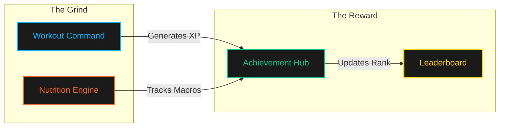
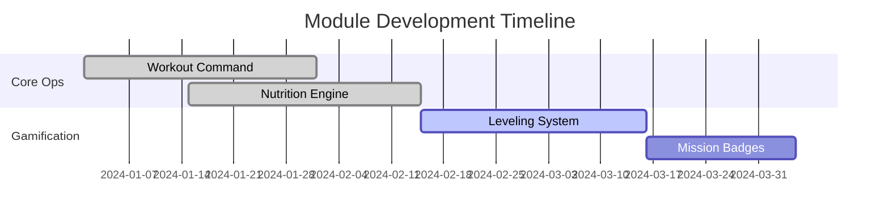

  

# 🦅 MEMBER COMMAND CENTER
### *Athletic Clarity • Precision Fueling • Performance Integrity*

---

---

## 🌀 ATHLETIC DATAFLOW

---

## 🚀 CORE SYSTEMS

### 🦾 WORKOUT COMMAND `(member/workout)`
The tactical hub for session execution.
- **Live Tracking**: Real-time logging of reps, weight, and volume.
- **Rest Orchestrator**: Integrated rest timers with tactile feedback.
- **Session History**: Detailed archive of every rep logged in the facility.

### 🥗 NUTRITION ENGINE `(member/nutrition)`
Precision fueling for peak performance.
- **Macro Surveillance**: Daily tracking of Protein, Carbs, and Fats.
- **Tactical Hydration**: Live water intake logging and history.
- **Recipe Archive**: Access to nutritionist-approved blueprints.

### 🏆 ACHIEVEMENT HUB `(member/achievements)`
Gamifying the pursuit of excellence.
- **Level Progression**: XP-based ranking system.
- **Mission Badges**: Visual milestones for consistency and strength.
- **Global Rank**: Real-time position on the facility leaderboard.

---

## 📊 PERFORMANCE MATURITY

---

  
<b>ELEVATE YOUR POTENTIAL</b>

  
Authorized for Member Personnel Only

