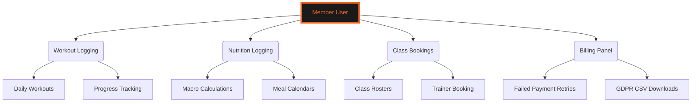
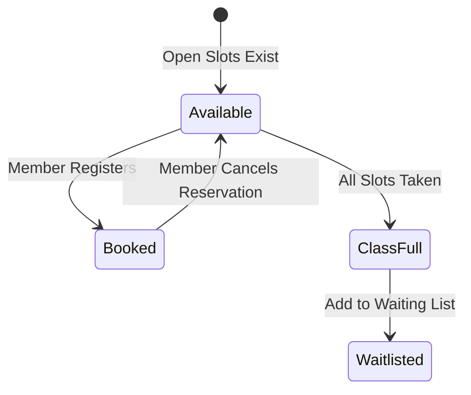
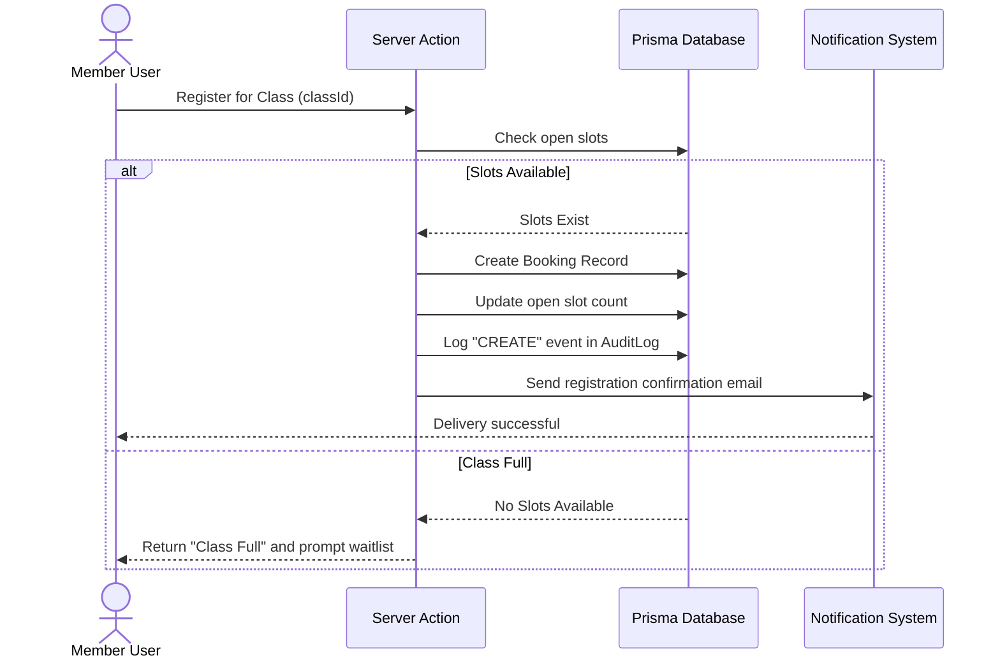
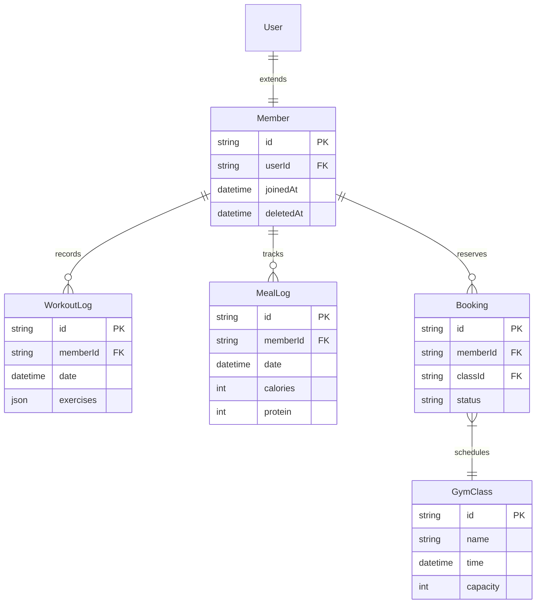

# 🏋️ ATHLETE PORTAL OPERATIONS GUIDE
### *Workout Tracking • Nutrition Monitoring • Billing Operations*

---

```
   GYMFLOW SaaS SYSTEM MODULE: MEMBER PORTAL
   ===========================================
   [AUTHORIZATION] : MEMBER (LEVEL 1) / ALL ACCESS
   [CLIENT SYSTEM] : MOBILE RESPONSIVE DASHBOARD
   ===========================================
```

---

## 📖 TABLE OF CONTENTS
1. [Ecosystem Overview](#1-ecosystem-overview)
2. [Workout Logging & Performance Metrics](#2-workout-logging--performance-metrics)
3. [Nutrition Logging & Macro Calculators](#3-nutrition-logging--macro-calculators)
4. [Classes & Personal Session Bookings](#4-classes--personal-session-bookings)
5. [Billing History & Self-Service Payment Retries](#5-billing-history--self-service-payment-retries)
6. [GDPR Data Portability & Anonymization requests](#6-gdpr-data-portability--anonymization-requests)
7. [Operational Activity Workflows](#7-operational-activity-workflows)
8. [Ecosystem Database Schema ER Diagram](#8-ecosystem-database-schema-er-diagram)

---

## 1. ECOSYSTEM OVERVIEW

The Member Portal allows gym members to track their fitness goals, manage their schedules, log meals and workouts, view challenge leaderboards, and update their subscription plans.



Members can access these features from both desktop and mobile devices.

---

## 2. WORKOUT LOGGING & PERFORMANCE METRICS

Members can track their workout routines, exercises, sets, reps, and weights.

### 2.1 Weight Lifting and Workout Tracking
The interface allows members to record their training metrics:

```
+-----------------------------------------------------------------+
|                       Barbell Bench Press                       |
+--------+------------------+------------------+------------------+
| Set 1  | 10 reps @ 60kg   | Completed        | RPE: 8           |
| Set 2  | 8 reps @ 70kg    | Completed        | RPE: 9           |
| Set 3  | 6 reps @ 80kg    | Completed        | RPE: 10          |
+--------+------------------+------------------+------------------+
```

These records are plotted on progress charts to track performance changes over time.

---

## 3. NUTRITION LOGGING & MACRO CALCULATORS

The Nutrition module provides members with tools to log meals and track daily macronutrient targets.

### 3.1 Macro Calculations
Members set their fitness goals (e.g., muscle gain, weight loss), and the system calculates their daily targets:

```
+-----------------------------------------------------------------+
|                         Nutrition Targets                       |
+---------------------+-------------------+----------------------+
| Target Calories     | Target Protein    | Target Carbs / Fats  |
+---------------------+-------------------+----------------------+
| 2,400 kcal          | 160g              | 220g / 70g           |
+---------------------+-------------------+----------------------+
| Consumed: 1,800 kcal| Consumed: 120g    | Consumed: 170g / 50g |
+---------------------+-------------------+----------------------+
```

Trainers can adjust these targets based on member progress.

---

## 4. CLASSES & PERSONAL SESSION BOOKINGS

Members can browse schedules and book group classes or personal training sessions.

### 4.1 Class Rosters and Session Bookings
Class listings display schedules, locations, and open spots:



If a spot opens up, waitlisted members are automatically registered.

---

## 5. BILLING HISTORY & SELF-SERVICE PAYMENT RETRIES

Members can manage their payment methods, check subscription billing dates, and retry failed renewals.

### 5.1 Failed Payment Retries
When a recurring payment fails, GymFlow logs the event, flags the account, and displays a red **"Retry"** option next to the failed transaction. Clicking it opens the Razorpay checkout portal, allowing the member to complete the transaction and restore access.

---

## 6. GDPR DATA PORTABILITY & ANONYMIZATION REQUESTS

GymFlow provides members with self-service tools to manage their data privacy.

### 6.1 Portability Exports
Under GDPR, members can download their full profile data, workout check-ins, and transaction histories in a structured CSV format.

### 6.2 Account Anonymization Requests
Members can request account deletion. To preserve billing histories for accounting audits, the system anonymizes personal details (name, email, phone) and disables login credentials instead of performing a hard database delete.

---

## 7. OPERATIONAL ACTIVITY WORKFLOWS

### 7.1 Class Booking Sequence
This sequence diagram shows the step-by-step process of booking a group class:



---

## 8. ECOSYSTEM DATABASE SCHEMA ER DIAGRAM

The following entity-relationship diagram shows how member tracking is mapped to database tables:



This database structure ensures isolation while supporting performance tracking and scheduling.

---

<div align="center">
  <p><b>GymFlow SaaS Portal • Member Operations Guide</b></p>
  <p>© 2026 GYMFLOW SAAS. ALL RIGHTS RESERVED.</p>
</div>
