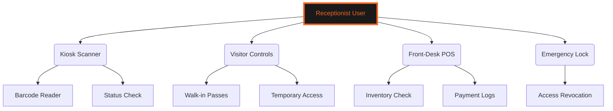
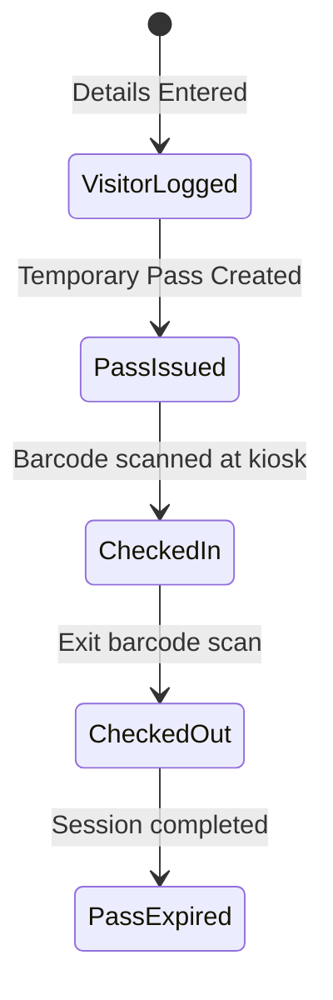
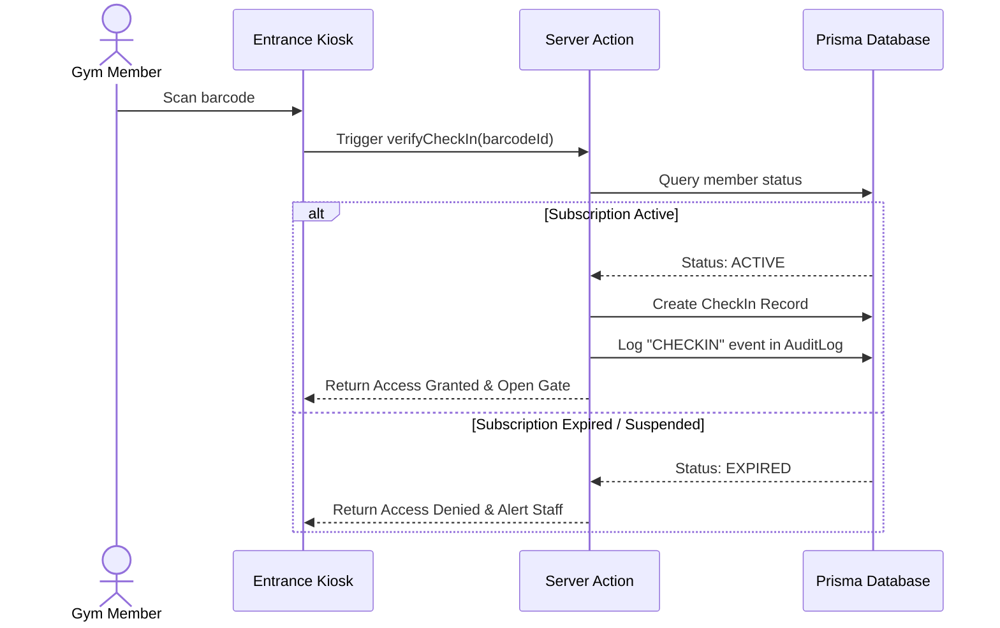
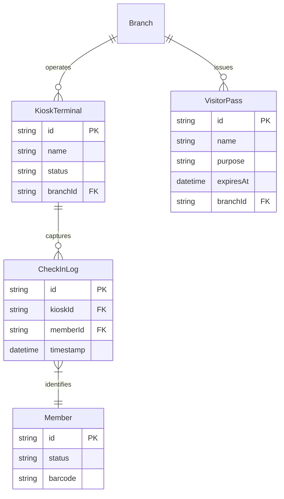

# 🛎️ RECEPTION & FRONT DESK OPERATIONS GUIDE
### *Barcode Verification • Visitor Access • POS Sales Management*

---

```
   GYMFLOW SaaS SYSTEM MODULE: RECEPTIONIST
   ===========================================
   [AUTHORIZATION] : RECEPTIONIST (LEVEL 2) / ADMIN (LEVEL 3)
   [INTERFACE]     : FRONT DESK SCANNERS / KIOSK CAMERA
   ===========================================
```

---

## 📖 TABLE OF CONTENTS
1. [Receptionist Interface Overview](#1-receptionist-interface-overview)
2. [Kiosk Scanning & Check-in Verification](#2-kiosk-scanning--check-in-verification)
3. [Visitor Passes & Walk-in Registrations](#3-visitor-passes--walk-in-registrations)
4. [Front-Desk Sales & POS Checkouts](#4-front-desk-sales--pos-checkouts)
5. [Emergency Lockdown & Safety Rules](#5-emergency-lockdown--safety-rules)
6. [Operational Activity Workflows](#6-operational-activity-workflows)
7. [Database Schema ER Diagram](#7-database-schema-er-diagram)
8. [Troubleshooting & Scanner Audits](#8-troubleshooting--scanner-audits)

---

## 1. RECEPTIONIST INTERFACE OVERVIEW

The Receptionist Module provides front-desk staff with tools to scan member barcodes, verify subscription statuses, issue visitor passes, and process cash or card product sales.



Receptionists manage facility access at the gym entrance.

---

## 2. KIOSK SCANNING & CHECK-IN VERIFICATION

Members scan their physical or digital barcodes at the kiosk scanner to check in.

### 2.1 Scanner Setup & Status Validation
The scanner resolves the member's profile and validates their subscription:

```
+-----------------------------------------------------------------+
|                       Kiosk Scan Result                         |
+---------------------+-------------------+----------------------+
| Member Name         | Subscription State| Access Status        |
+---------------------+-------------------+----------------------+
| Siddharth Varma     | ACTIVE            | ACCESS GRANTED       |
| Priya Sharma        | EXPIRED           | ACCESS DENIED        |
| Vikram Singh        | SUSPENDED         | ACCESS DENIED        |
+---------------------+-------------------+----------------------+
```

If access is denied, the kiosk flags the account and alerts the receptionist staff.

---

## 3. VISITOR PASSES & WALK-IN REGISTRATIONS

For non-members, receptionists can issue temporary visitor passes or register walk-ins.

### 3.1 Visitor Roster Logs
Visitor details are recorded for security and tracking purposes:



Expired visitor passes are automatically deactivated.

---

## 4. FRONT-DESK SALES & POS CHECKOUTS

Receptionists process supplement and merchandise sales using the built-in POS interface.
* **POS Checkout**: Receptionists select products, adjust quantities, process payments, and generate invoices. The system updates stock levels in real time.

---

## 5. EMERGENCY LOCKDOWN & SAFETY RULES

In the event of a security incident, receptionists can trigger the Emergency Lockout.
* **Emergency Lockout**: Instantly blocks all kiosk scans, revokes active guest passes, and locks the branch entrance gates. Access can only be restored by system administrators.

---

## 6. OPERATIONAL ACTIVITY WORKFLOWS

### 6.1 Kiosk Check-in Sequence
This sequence diagram shows the step-by-step check-in process at the entrance kiosk:



---

## 7. DATABASE SCHEMA ER DIAGRAM

The following entity-relationship diagram shows how front-desk operations map to database tables:



This structure supports secure check-ins and visitor tracking.

---

## 8. TROUBLESHOOTING & SCANNER AUDITS

### 8.1 Resolution Procedures for Front-Desk Issues

#### Issue: Barcode Scanner Fails to Read Codes
* **Possible Cause**: Low brightness on the member's device or scan window is dirty.
* **Resolution**: Clean the scanner screen and ensure the device screen brightness is set to maximum.

#### Issue: Active Member Flagged as Denied
* **Possible Cause**: Database sync delay or incorrect subscription status mapping.
* **Resolution**: Check the member's subscription details in the Admin panel and manually trigger a status refresh.

#### Issue: Kiosk Terminal Disconnected
* **Possible Cause**: Local network outage.
* **Resolution**: Check the terminal's network connection and restart the Kiosk app.

---

<div align="center">
  <p><b>GymFlow SaaS Portal • Receptionist Operations Guide</b></p>
  <p>© 2026 GYMFLOW SAAS. ALL RIGHTS RESERVED.</p>
</div>
