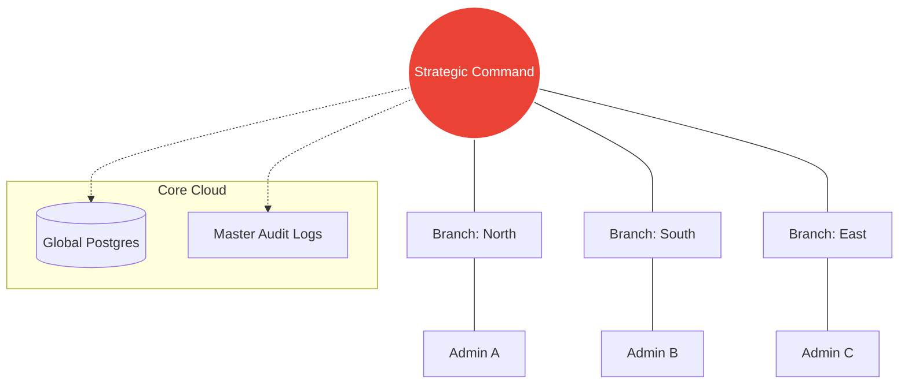
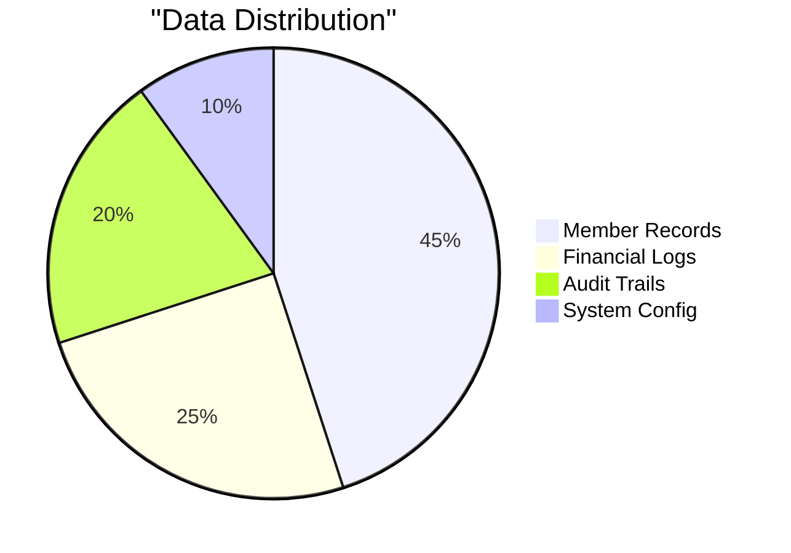

# 🦅 SUPER ADMIN STRATEGIC COMMAND
### *Ecosystem Governance • Multi-Branch Orchestration • System Integrity*

---

---

## 🌀 ECOSYSTEM TOPOLOGY

---

## 🚀 CORE SYSTEMS

### 🌐 GLOBAL NETWORK `(super-admin/branches)`
- **Multi-Tenant Control**: Managing isolated environments for every branch.
- **Cross-Branch Intelligence**: comparing performance across the entire network.
- **Deployment Control**: instant rollout of new features to all locations.

### ⚙️ SYSTEM CORE `(super-admin/system-config)`
- **Identity Governance**: managing global branding and support protocols.
- **Security Logic**: governing MFA, session timeouts, and RBAC rules.
- **API Orchestration**: managing integrations with payment and CRM gateways.

### 🔍 AUDIT SURVEILLANCE `(super-admin/audit-logs)`
- **Forensic Logs**: deep-tracking of every mutation in the ecosystem.
- **Backups & Recovery**: managing global data integrity and failover.
- **Permission Matrix**: governing the master role-access hierarchy.

### 🎮 STRATEGIC COMMAND `(super-admin)`
- **Executive Analytics**: Side-by-side branch comparison of revenue and membership distribution.
- **System Integrity**: Real-time health monitoring of database clusters, payment gateways, and core services.
- **Quick Action Hub**: Centralized jumping-off point for critical administrative tasks.
- **Localized View**: Advanced branch-level filtering for member and payment directories.

---

## 📊 SYSTEM COMPOSITION

---

  
<b>GOVERNANCE WITH CLARITY</b>

  
Authorized for System Owners Only

