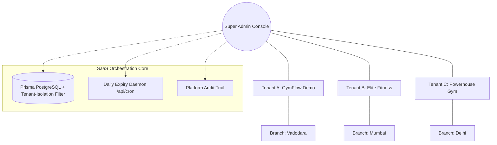
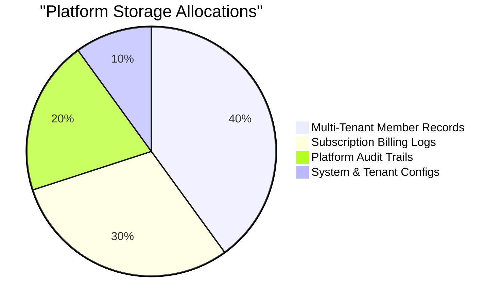

# 🦅 SUPER ADMIN PLATFORM CONTROL CONSOLE
### *Ecosystem Governance • Tenant Onboarding • Platform Integrity*

---

---

## 🌀 MULTI-TENANT ECOSYSTEM TOPOLOGY

GymFlow operates on a shared-database, multi-tenant SaaS architecture. Super Admins manage the tenants (individual gyms/gym networks), pricing tiers, system configurations, and platform health.

---

## 🚀 CORE PLATFORM MODULES

### 🏢 TENANT MANAGEMENT `(super-admin/tenants)`
- **SaaS Onboarding**: Complete dashboard showing active, inactive, and suspended gym tenants.
- **Tenant Actions**: Suspend or reactivate tenants dynamically, which triggers immediate NextAuth authentication blocks for all user accounts belonging to that tenant.
- **Gym Configuration Mapping**: Links gym tenants to their specific custom domains, subdomains, and SaaS subscription tiers.

### ⚙️ SYSTEM LOCALIZATION `(super-admin/system-config)`
- **Dynamic Currency Settings**: Configures the default platform currency (`INR`, `USD`, `EUR`, `GBP`) mapping to corresponding locale formats (`en-IN`, `en-US`, `de-DE`) stored in `localStorage` for responsive client-side rendering.
- **Localization Variables**: Configures default timezones (`UTC`, `IST`, `EST`, `PST`) and date formats (`DD/MM/YYYY`, `MM/DD/YYYY`).
- **Feature Access Flags**: Toggles email notifications, SMS alerts, WhatsApp message routing, and MFA checks globally.

### 🕒 SUBSCRIPTION EXPIRY CRON `(/api/cron)`
- **Automated Expiring Logic**: Secured by `CRON_SECRET` headers to run daily at midnight.
- **Dynamic State Management**: Detects expired subscriptions, transitions user roles, and suspends delinquent tenant accounts.

### 🔍 AUDIT SURVEILLANCE `(super-admin/audit-logs)`
- **Forensic Actions Tracker**: Records administrative actions (create branch, import members, update system settings) including origin IP address and browser User-Agent.
- **Backups Console (`super-admin/backups`)**: Handles manual and scheduled snapshots of multi-tenant database records.

---

## 📊 PLATFORM DATA COMPOSITION

---

  
<b>GOVERNANCE WITH INTEGRITY</b>

  
Authorized for Platform Administrators Only • GymFlow SaaS Core

