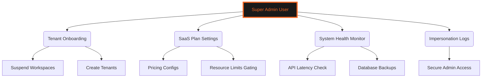
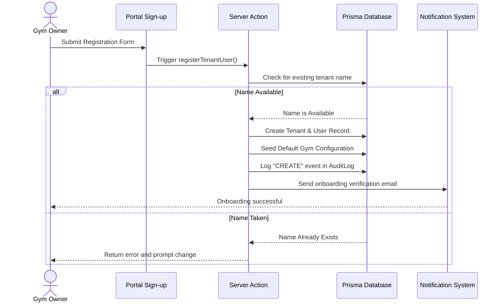
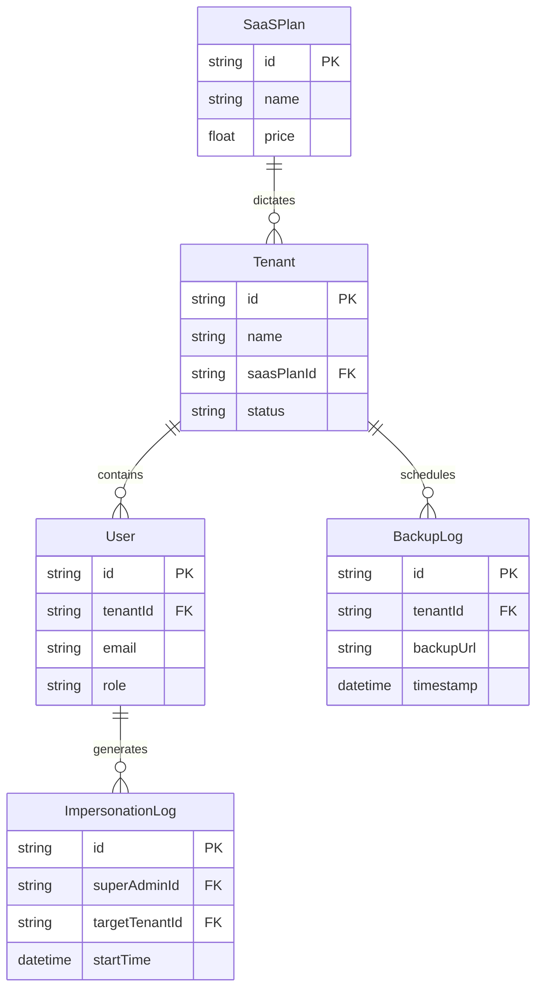

# 👑 SUPER-ADMIN MANAGEMENT PORTAL
### *SaaS Onboarding • Plan Settings • Tenant Impersonation Rules*

---

```
   GYMFLOW SaaS SYSTEM MODULE: SUPER-ADMIN
   ===========================================
   [AUTHORIZATION] : SUPER-ADMIN (MASTER ACCESS)
   [PLATFORM CORE] : MULTI-TENANCY CONTROL CENTER
   ===========================================
```

---

## 📖 TABLE OF CONTENTS
1. [Platform Infrastructure Architecture](#1-platform-infrastructure-architecture)
2. [Tenant Onboarding & Activation](#2-tenant-onboarding--activation)
3. [Global SaaS Plan Configurations](#3-global-saas-plan-configurations)
4. [Admin Impersonation Protocol](#4-admin-impersonation-protocol)
5. [System Backups & Data Export Controls](#5-system-backups--data-export-controls)
6. [Ecosystem Onboarding Workflow Diagram](#6-ecosystem-onboarding-workflow-diagram)
7. [System Database Schema ER Diagram](#7-system-database-schema-er-diagram)
8. [Troubleshooting & Platform Recovery](#8-troubleshooting--platform-recovery)

---

## 1. PLATFORM INFRASTRUCTURE ARCHITECTURE

The Super-Admin Module is the control center for GymFlow. It allows platform administrators to onboard new tenants, configure pricing plans, manage backups, run security audits, and troubleshoot tenant workspaces.



Super Admins have master access to the platform configuration tables.

---

## 2. TENANT ONBOARDING & ACTIVATION

The onboarding process registers a new business and creates an isolated workspace tenant.

### 2.1 Workspace Status Lifecycle
Tenants transition through the following lifecycle states:

* **PENDING**: Registration completed, waiting for email confirmation.
* **ACTIVE**: Workspace active and operational. Users can access dashboards.
* **SUSPENDED**: Account locked due to failed payments or violations. Access is blocked.
* **LOCKED**: Closed due to security emergencies or admin action.

---

## 3. GLOBAL SaaS PLAN CONFIGURATIONS

Super Admins configure plan pricing and resource limits (member counts, branch counts) for each tier.

### 3.1 Plan Configurations and Resource Limits
Plan definitions are stored in the `SaaSPlan` table:

```
+-----------------------------------------------------------------+
|                       SaaS Plan Configs                         |
+---------------------+-------------------+----------------------+
| Plan Name           | Price / Month     | Resource Limits      |
+---------------------+-------------------+----------------------+
| Free Plan           | $0.00             | 100 Members, 1 Branch|
| Pro Plan            | $99.00            | 1000 Members, 5 Br   |
| Enterprise Plan     | Custom            | Unlimited            |
+---------------------+-------------------+----------------------+
```

These limits are enforced on the database level when tenants create new records.

---

## 4. ADMIN IMPERSONATION PROTOCOL

Super Admins can impersonate gym administrators to troubleshoot configuration issues.
* **Security Audits**: Impersonation sessions bypass credentials checks but are recorded in the `AuditLog` table to prevent abuse.

---

## 5. SYSTEM BACKUPS & DATA EXPORT CONTROLS

Super Admins manage database backups and data migration workflows.
* **Backups**: The system runs daily automated backups. Super Admins can download encrypted database exports or restore previous system snapshots if necessary.

---

## 6. ECOSYSTEM ONBOARDING WORKFLOW DIAGRAM

This sequence diagram shows the onboarding process for a new gym tenant:



---

## 7. SYSTEM DATABASE SCHEMA ER DIAGRAM

The following entity-relationship diagram shows the relational mappings for platform configuration:



---

## 8. TROUBLESHOOTING & PLATFORM RECOVERY

### 8.1 Resolution Procedures for Platform Incidents

#### Issue: Workspace Creation Timeout
* **Possible Cause**: Database connection limits exceeded during the tenant seed phase.
* **Resolution**: Check the connection pool status and increase timeouts in the Prisma connection settings.

#### Issue: Impersonation Access Denied
* **Possible Cause**: Attacker attempting to bypass authentication checkpoints using expired session tokens.
* **Resolution**: Verify the Super Admin's roles and session state, and confirm the action was logged in the `AuditLog` table.

#### Issue: Daily Backup Task Failure
* **Possible Cause**: Cloud storage endpoint is unavailable or connection configurations are incorrect.
* **Resolution**: Verify storage credentials in the environment variables and run a manual backup to confirm access.

---

<div align="center">
  <p><b>GymFlow SaaS Portal • Super-Admin Management Guide</b></p>
  <p>© 2026 GYMFLOW SAAS. ALL RIGHTS RESERVED.</p>
</div>
