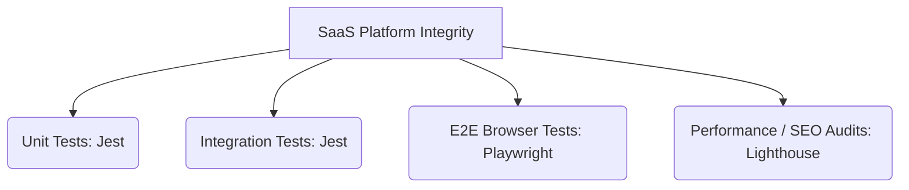

# SaaS QA & Testing Strategy Guide

This guide maps out the multi-layer testing architecture for **GymFlow SaaS** to ensure high performance, security, and regression safety across all feature modules.

---

## 1. Multi-Layer Testing Architecture

We enforce a tiered QA model:



| Layer | Framework | Description | Command |
| :--- | :--- | :--- | :--- |
| **Unit** | Jest | Tests schemas, utilities, mapping, formatting | `npm test` |
| **Integration** | Jest | Tests API routes response types and Mock DB client states | `npm test` |
| **E2E** | Playwright | Simulates real user flows in Chromium, Firefox, WebKit | `npm run test:e2e` |
| **Performance** | Lighthouse | Validates accessibility, SEO, and web vitals | Local audits / LHCI |

---

## 2. Unit & Integration Testing (Jest)

Our Jest suites verify the logic of isolated components and backend validators:
* **Payload Validators**: Ensures `LoginSchema`, `RegisterSchema`, and `PasswordSchema` enforce security rules.
* **Database Mock Checks**: Simulates tenant routing and database isolation.
* **Commands**:
  * Run tests: `npm test`
  * Watch mode: `npm run test:watch`
  * Coverage reports: `npm run test:coverage`

---

## 3. End-to-End (E2E) Browser Testing (Playwright)

Playwright runs full-browser automation to guarantee key user flows never regress:
* **Redirects**: Validates that unauthenticated users visiting protected layouts are sent back to `/login`.
* **Forms & DOM**: Checks that form validation messages present correctly on submitting empty inputs.
* **Cross-Browser Verification**: Tests layouts against Chromium, Firefox, and WebKit (Safari).
* **Commands**:
  * Run headless: `npm run test:e2e`
  * Run E2E UI dashboard mode: `npm run test:e2e:ui`

---

## 4. Web Vitals & Accessibility (Lighthouse CI)

To ensure the portal remains lightning-fast and accessible (complying with WCAG AA standards):
1. **Lighthouse Audits**: Check your page scores (Performance, Accessibility, Best Practices, SEO) in Chrome DevTools or Lighthouse CI.
2. **Vercel Integration**: Vercel automatically runs Lighthouse audits on every preview deployment, showing web vitals and accessibility regressions directly inside GitHub PR comments.

---

## 5. Security & Load Testing Recommendations

* **Dependency Scanning**: Enforced automatically in the CI pipeline via `npm audit --audit-level=high`.
* **Load Testing (k6)**: For load testing peak checkout or registration traffic, we recommend running **Grafana k6**:
  * Install: `choco install k6` or equivalent package manager.
  * Example script:
    ```javascript
    import http from 'k6/http';
    import { sleep } from 'k6';
    export default function () {
      http.get('https://app.gymflow.io/login');
      sleep(1);
    }
    ```
