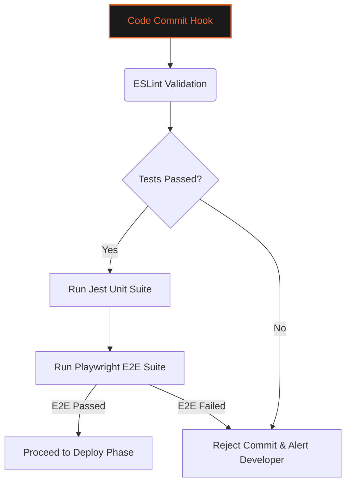
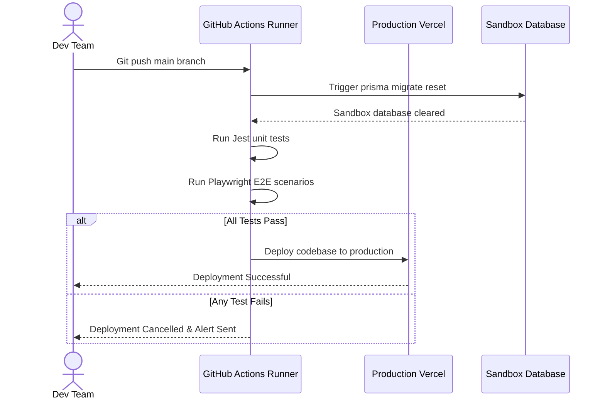

# 🧪 TEST SUITE & QUALITY ASSURANCE STRATEGY
### *Jest Unit Tests • Playwright E2E Automation • CI Run Assertions*

---

```
   GYMFLOW SaaS SYSTEM MODULE: TESTING CORE
   ===========================================
   [ENGINE]        : JEST / PLAYWRIGHT
   [CI AUTOMATION] : GITHUB ACTIONS INTEGRATED
   ===========================================
```

---

## 📖 TABLE OF CONTENTS
1. [Quality Assurance Framework](#1-quality-assurance-framework)
2. [Jest Unit & Integration Testing](#2-jest-unit--integration-testing)
3. [Playwright End-to-End (E2E) Testing](#3-playwright-end-to-end-e2e-testing)
4. [CI Pipeline Automation](#4-ci-pipeline-automation)
5. [Ecosystem Database Sandbox Configuration](#5-ecosystem-database-sandbox-configuration)
6. [Ecosystem Testing Lifecycle Diagram](#6-ecosystem-testing-lifecycle-diagram)
7. [Comprehensive Assertions Matrix](#7-comprehensive-assertions-matrix)
8. [Troubleshooting Test Failures](#8-troubleshooting-test-failures)

---

## 1. QUALITY ASSURANCE FRAMEWORK

The Quality Assurance and Testing Strategy covers unit testing using Jest, end-to-end (E2E) automation via Playwright, and test assertions in GymFlow.



We run automated checks on every push to maintain code quality.

---

## 2. JEST UNIT & INTEGRATION TESTING

We use Jest to verify utility logic, helper methods, Zod validations, and API routes.
* **Database Mocking**: Relies on Prisma client mocks to isolate database requests.
* **Endpoint Assertions**: Checks route codes, headers, and payload schemas.

---

## 3. PLAYWRIGHT END-TO-END (E2E) TESTING

We use Playwright to simulate real user interactions and verify application workflows.

```
+-----------------------------------------------------------------+
|                       Playwright E2E Scenarios                  |
+---------------------+---------------------+---------------------+
| Scenario A: Login   | Scenario B: Kiosk   | Scenario C: Billing |
| & 2FA Flow Checks   | Scans & Check-in    | Checkout Retries    |
+---------------------+---------------------+---------------------+
           |                     |                     |
           v                     v                     v
[Validates OTP code]  [Verifies status scan] [Triggers Razorpay]
[challenges UI]       [opens entrance gates] [payment failures]
```

These automated user scenarios prevent regressions on key layout pages.

---

## 4. CI PIPELINE AUTOMATION

The test suite runs automatically in our GitHub Actions workflow on code updates.

```mermaid
stateDiagram-v2
    [*] --> BuildTriggered : Code updates pushed
    BuildTriggered --> DependencyInstall : Run npm install
    DependencyInstall --> RunLinter : Run npm run lint
    RunLinter --> RunJestSuite : Run Jest tests
    RunJestSuite --> RunPlaywrightSuite : Run Playwright tests
    
    RunPlaywrightSuite -- Success --> CompileOutput : Code builds cleanly
    CompileOutput --> DeployEcosystem : Deployment active
    
    RunPlaywrightSuite -- Failure --> CancelTask : Deploy aborted
    RunJestSuite -- Failure --> CancelTask
```

Deployments are blocked if any test fails.

---

## 5. ECOSYSTEM DATABASE SANDBOX CONFIGURATION

E2E testing workflows execute against isolated sandbox database instances.
* **Data Resets**: The test runner runs database migrations and seeds fresh test presets before executing scenarios, preventing state contamination.

---

## 6. ECOSYSTEM TESTING LIFECYCLE DIAGRAM

This sequence diagram shows the automated build check and deployment lifecycle:



---

## 7. COMPREHENSIVE ASSERTIONS MATRIX

Our test coverage includes the following critical assertions:

| Target Scope | Test Type | Assertion Target | Expected Value |
| :--- | :--- | :--- | :--- |
| **API Rate Limiter**| Jest Unit | Check request limit triggers. | Return `status: 429` |
| **2FA Verification**| Jest Unit | Validate OTP expiry limits. | Reject expired tokens |
| **GDPR CSV Exports**| Integration | Verify authorization headers. | Return `status: 401` on missing auth |
| **Webhook signature**| Jest Unit | Validate HMAC matches. | Return `true` on correct keys |
| **Cron Expiry Task**| E2E Scenario | Set active plans to expired. | Set status to `EXPIRED` |

---

## 8. TROUBLESHOOTING TEST FAILURES

### 8.1 Resolution Procedures for Test Incidents

#### Issue: Jest Fails with Database Connection Error
* **Possible Cause**: Sandbox database URL is misconfigured or unreachable.
* **Resolution**: Verify that the database is running and check connection strings in the env variables.

#### Issue: Playwright Timeouts on Form Submission
* **Possible Cause**: Slow API response times or missing loader indicators.
* **Resolution**: Verify database response times and ensure loader components render correctly.

#### Issue: Rate Limiter Tests Fail
* **Possible Cause**: Redis connection credentials are invalid or expired.
* **Resolution**: Check Redis configurations and confirm connection status using the CLI.

---

<div align="center">
  <p><b>GymFlow SaaS Portal • QA & Test Strategy Guide</b></p>
  <p>© 2026 GYMFLOW SAAS. ALL RIGHTS RESERVED.</p>
</div>
