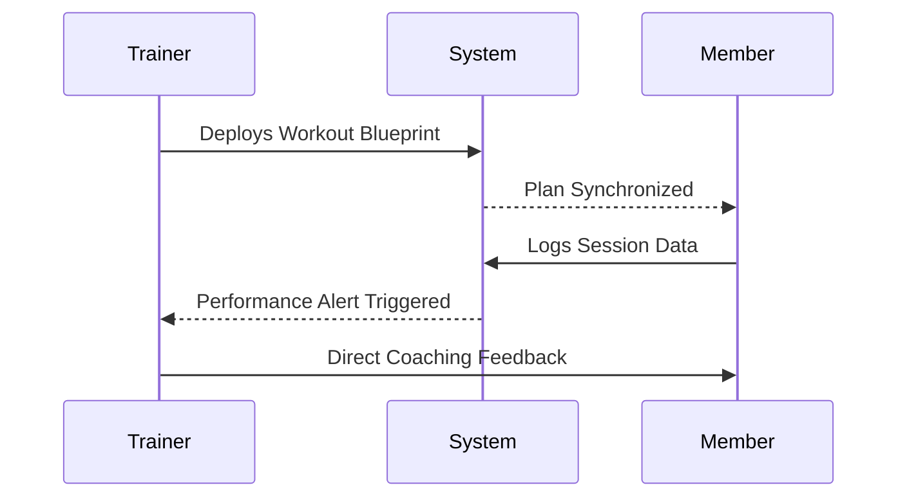
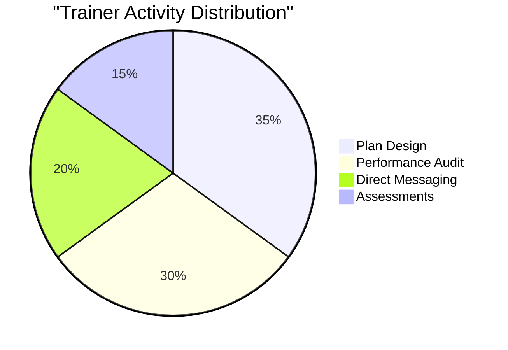

# 🦅 TRAINER COMMAND CENTER
### *Squad Management • Blueprint Deployment • Performance Analytics*

---

---

## 🌀 COACHING SEQUENCE

---

## 🚀 CORE SYSTEMS

### 👥 SQUAD MANAGEMENT `(trainer/my-members)`
- **Member Roster**: Complete visibility of assigned athletes.
- **Client Profiles**: Deep-dive into medical history, goals, and metrics.
- **Progress Surveillance**: side-by-side photo comparison for transformation audits.

### 📜 BLUEPRINT FORGE `(trainer/workouts)`
- **Tactical Builder**: Create complex training regimens with precision.
- **Diet Protocol**: Configure macro-targets and meal structures.
- **Template Engine**: Rapid deployment of proven training strategies.

### 📈 ANALYTICS TERMINAL `(trainer/progress)`
- **Volume Tracking**: Monitoring cumulative load over time.
- **Consistency Audits**: Identifying gaps in athlete check-ins.
- **Strength Milestones**: Visualizing 1RM progression across major lifts.

---

## 📊 OPERATIONAL LOAD

---

  
<b>PRECISION IN COACHING</b>

  
Authorized for Certified Trainer Personnel Only

