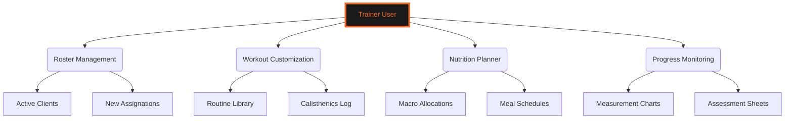
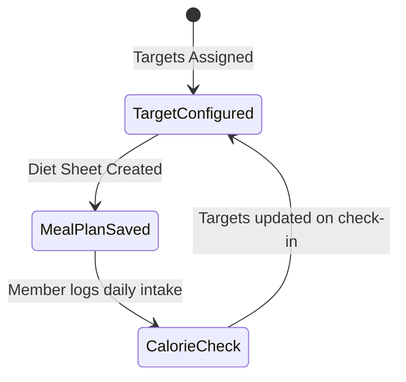
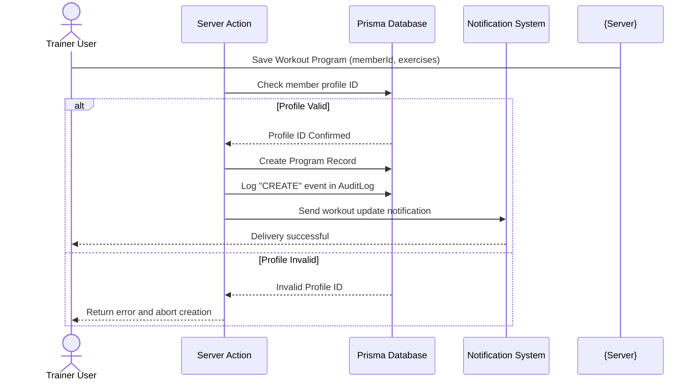
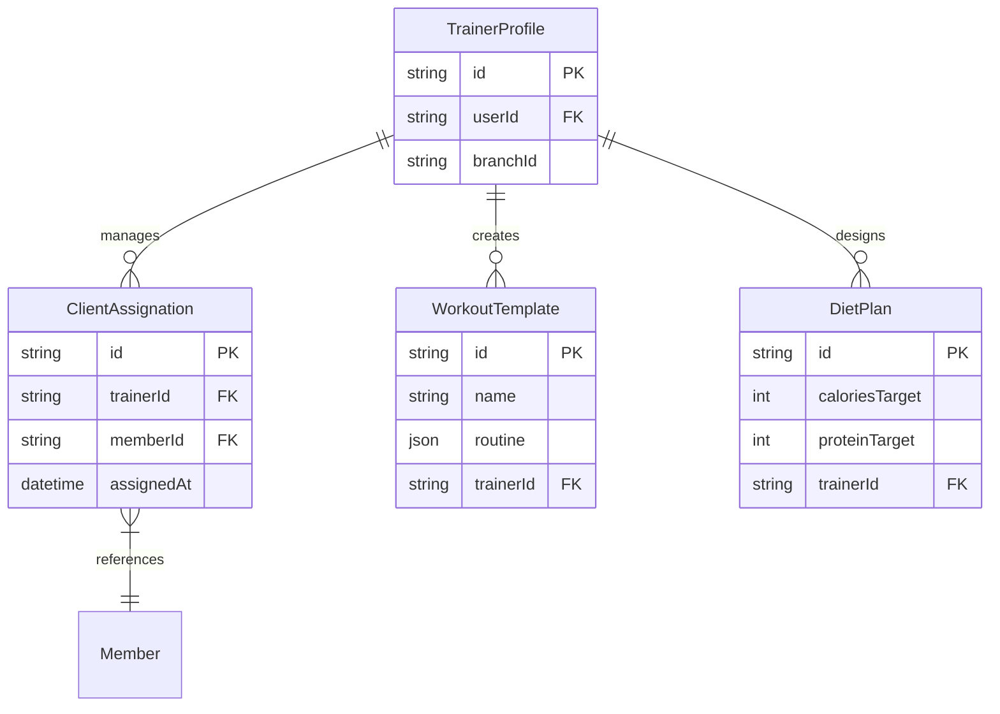

# 📋 TRAINER WORKFLOWS & CLIENT MANAGEMENT GUIDE
### *Workout Assignment • Diet Customization • Progress Monitoring*

---

```
   GYMFLOW SaaS SYSTEM MODULE: TRAINER PORTAL
   ===========================================
   [AUTHORIZATION] : TRAINER (LEVEL 2) / ADMIN (LEVEL 3)
   [CLIENT SYSTEM] : WEB / MOBILE RESPONSIVE DASHBOARD
   ===========================================
```

---

## 📖 TABLE OF CONTENTS
1. [Trainer Interface Overview](#1-trainer-interface-overview)
2. [Workout Program Builder](#2-workout-program-builder)
3. [Nutrition & Calorie Allocation Panel](#3-nutrition--calorie-allocation-panel)
4. [Client Progress Monitoring](#4-client-progress-monitoring)
5. [Direct Client Communications](#5-direct-client-communications)
6. [Operational Activity Workflows](#6-operational-activity-workflows)
7. [Database Schema ER Diagram](#7-database-schema-er-diagram)
8. [Troubleshooting & Program Customization](#8-troubleshooting--program-customization)

---

## 1. TRAINER INTERFACE OVERVIEW

The Trainer Module provides fitness trainers with tools to manage assigned client rosters, build workout routines, track caloric targets, and monitor client progress.



Trainers design personalized programs for their assigned members.

---

## 2. WORKOUT PROGRAM BUILDER

Trainers can build custom exercise routines using the built-in program template editor.

### 2.1 Routine Logs & Exercise Definitions
Trainers customize exercises, sets, reps, and target loads:

```
+-----------------------------------------------------------------+
|                       Deadlift Program                          |
+--------+------------------+------------------+------------------+
| Set 1  | 8 reps @ 100kg   | Intensity: Low   | Rest: 120s       |
| Set 2  | 6 reps @ 120kg   | Intensity: Medium| Rest: 120s       |
| Set 3  | 4 reps @ 140kg   | Intensity: High  | Rest: 180s       |
+--------+------------------+------------------+------------------+
```

These programs are delivered to the member's portal automatically upon assignment.

---

## 3. NUTRITION & CALORIE ALLOCATION PANEL

Trainers set daily calorie and macronutrient targets for members based on their goals.

### 3.1 Diet Logs & Macro Configs
Calculates macro targets using the built-in calculator:



These allocations update the member's portal dashboard.

---

## 4. CLIENT PROGRESS MONITORING

Trainers track member progress, including body weight, body fat percentage, and training history.
* **Progress Graphs**: Displays change charts mapping metrics over time to help trainers adjust programs.

---

## 5. DIRECT CLIENT COMMUNICATIONS

The Messaging interface allows trainers to communicate with their clients.
* **Message Logs**: Tracks messages between trainers and clients to maintain communication.

---

## 6. OPERATIONAL ACTIVITY WORKFLOWS

### 6.1 Program Creation Sequence
This sequence diagram shows the step-by-step process of creating a training program:



---

## 7. DATABASE SCHEMA ER DIAGRAM

The following entity-relationship diagram shows how trainer activities map to database tables:



---

## 8. TROUBLESHOOTING & PROGRAM CUSTOMIZATION

### 8.1 Resolution Procedures for Trainer Issues

#### Issue: Workout Template Fails to Load
* **Possible Cause**: Invalid characters in the exercise JSON data.
* **Resolution**: Re-save the template using standard characters.

#### Issue: Macro Targets Out of Bounds
* **Possible Cause**: Calorie inputs exceed maximum allowed limits.
* **Resolution**: Verify targets and ensure inputs match the member's calorie profile.

#### Issue: Client Not Showing in Roster
* **Possible Cause**: Client is assigned to a different branch or trainer.
* **Resolution**: Check assignments in the Admin panel.

---

<div align="center">
  <p><b>GymFlow SaaS Portal • Trainer Operations Guide</b></p>
  <p>© 2026 GYMFLOW SAAS. ALL RIGHTS RESERVED.</p>
</div>
