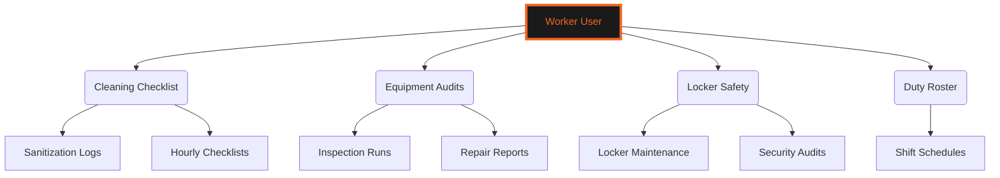
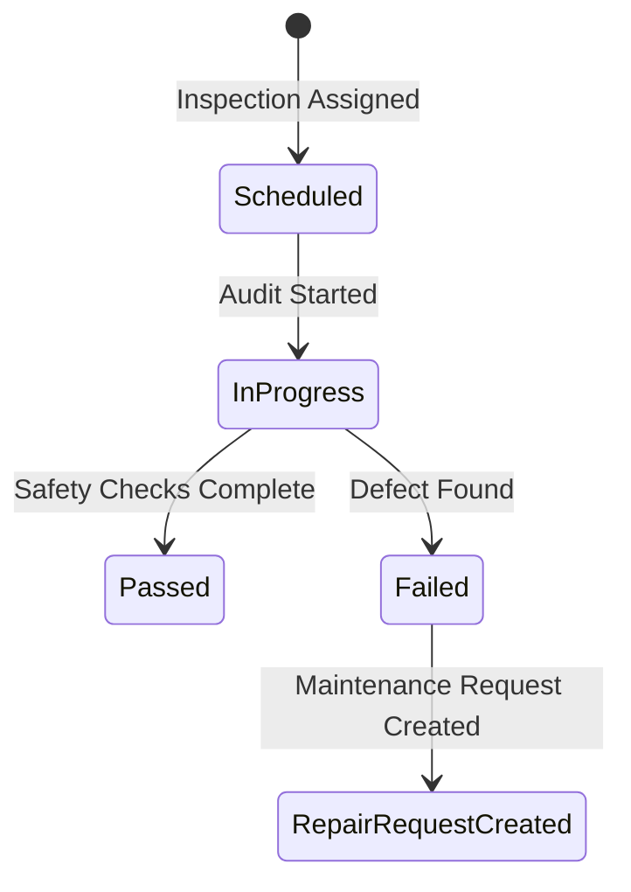
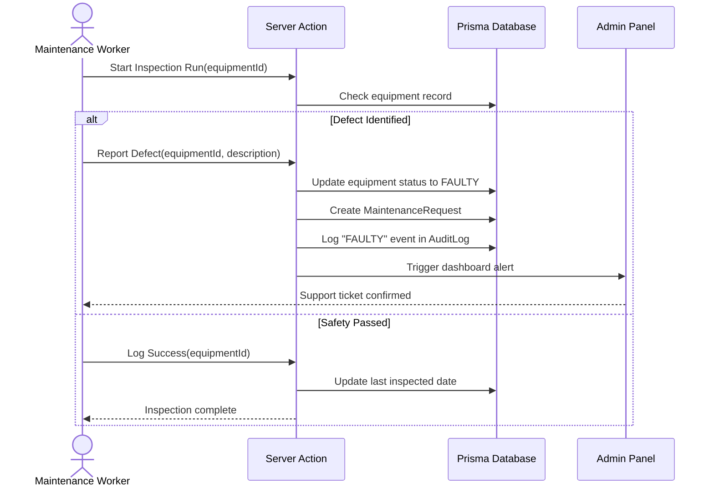
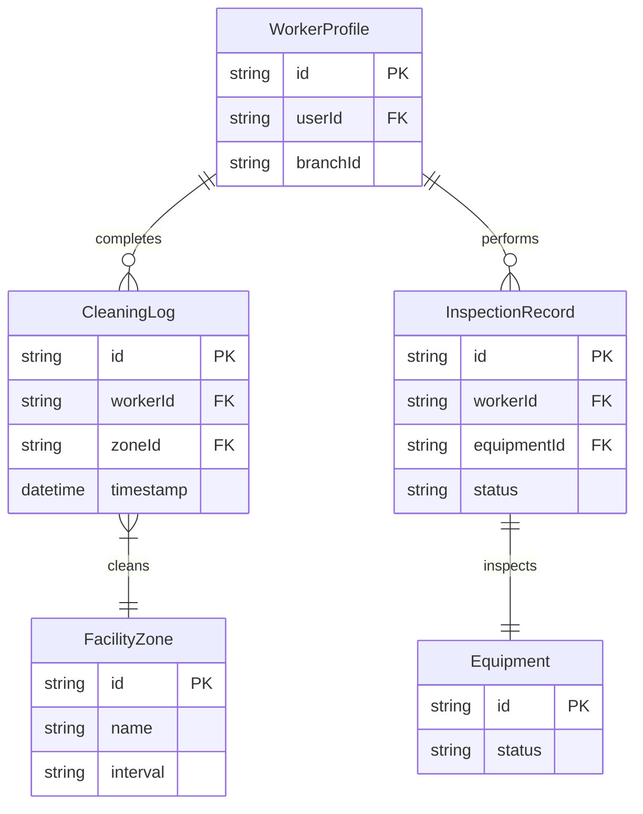

# 🧹 FACILITY MAINTENANCE & SAFETY OPERATIONS GUIDE
### *Cleaning Schedules • Equipment Auditing • Inspection Logs*

---

```
   GYMFLOW SaaS SYSTEM MODULE: WORKER PORTAL
   ===========================================
   [AUTHORIZATION] : MAINTENANCE WORKER (LEVEL 2)
   [INTERFACE]     : MOBILE MOBILE RESPONSIVE PANEL
   ===========================================
```

---

## 📖 TABLE OF CONTENTS
1. [Worker Interface Overview](#1-worker-interface-overview)
2. [Facility Cleaning & Hygiene Schedules](#2-facility-cleaning--hygiene-schedules)
3. [Equipment Inspection & Health Logging](#3-equipment-inspection--health-logging)
4. [Security Lockers & Facility Safety Checks](#4-security-lockers--facility-safety-checks)
5. [Worker Shift Planning & Duty Rosters](#5-worker-shift-planning--duty-rosters)
6. [Operational Activity Workflows](#6-operational-activity-workflows)
7. [Database Schema ER Diagram](#7-database-schema-er-diagram)
8. [Troubleshooting & Equipment Repair Actions](#8-troubleshooting--equipment-repair-actions)

---

## 1. WORKER INTERFACE OVERVIEW

The Worker Module provides cleaning and maintenance staff with tools to complete floor cleaning checklists, report damaged equipment, and track maintenance tasks.



Staff track cleaning and equipment inspections on the Worker dashboard.

---

## 2. FACILITY CLEANING & HYGIENE SCHEDULES

Staff follow cleaning checklists to maintain hygiene standards in high-traffic zones.

### 2.1 Zone-Based Sanitization Logs
Cheklist tasks are organized by facility zones:

```
+-----------------------------------------------------------------+
|                        Cleaning Rota                            |
+--------+------------------+------------------+------------------+
| Zone A | Cardio Deck      | Hourly Wipe-down | Completed        |
| Zone B | Locker Rooms     | Sanitization Run | Completed        |
| Zone C | Free Weights     | Rack Re-order    | Pending          |
+--------+------------------+------------------+------------------+
```

These tasks update the cleaning dashboard in real time.

---

## 3. EQUIPMENT INSPECTION & HEALTH LOGGING

Workers inspect equipment regularly to verify safety standards.

### 3.1 Equipment Audits and Status Mapping
Inspection workflows follow safety protocols:



Workers report equipment issues directly to system administrators.

---

## 4. SECURITY LOCKERS & FACILITY SAFETY CHECKS

Staff perform daily audits of locker rooms and facility safety equipment.
* **Locker Maintenance**: Checking security locks, resetting codes, and reporting damaged lockers.

---

## 5. WORKER SHIFT PLANNING & DUTY ROSTERS

Shift rosters coordinate maintenance and cleaning coverage.
* **Shifts**: Planned across multiple time slots to ensure staff presence during peak training hours.

---

## 6. OPERATIONAL ACTIVITY WORKFLOWS

### 6.1 Task Execution Sequence
This sequence diagram shows the step-by-step task tracking process:



---

## 7. DATABASE SCHEMA ER DIAGRAM

The following entity-relationship diagram shows how worker tasks are mapped to database tables:



---

## 8. TROUBLESHOOTING & EQUIPMENT REPAIR ACTIONS

### 8.1 Resolution Procedures for Maintenance Issues

#### Issue: Cleaning Log Failure to Save
* **Possible Cause**: Network latency on mobile devices.
* **Resolution**: Reconnect to the local Wi-Fi and resubmit the task form.

#### Issue: Equipment Defect Alert Delay
* **Possible Cause**: Dashboard notification alerts are disabled or pending.
* **Resolution**: Check the Admin Panel settings and verify notification settings.

#### Issue: Missing Locker Assignment Logs
* **Possible Cause**: Lock assignment conflicts in the database.
* **Resolution**: Clear assignments and reset the locker mapping.

---

<div align="center">
  <p><b>GymFlow SaaS Portal • Worker Operations Guide</b></p>
  <p>© 2026 GYMFLOW SAAS. ALL RIGHTS RESERVED.</p>
</div>
