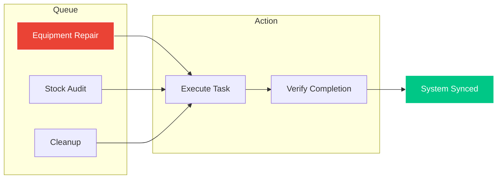
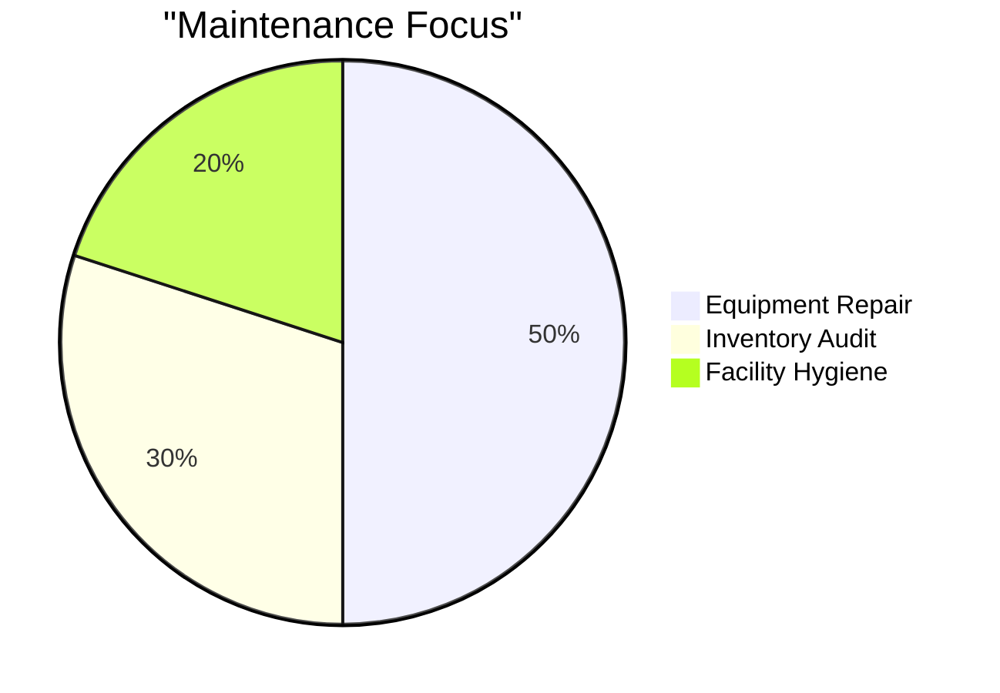

# 🦅 WORKER SUPPORT TERMINAL
### *Facility Maintenance • Asset Integrity • Tactical Support*

---

---

## 🌀 MAINTENANCE LOGIC

---

## 🚀 CORE SYSTEMS

### 🛠️ TASK TERMINAL `(worker/tasks)`
- **Live Queue**: real-time feed of facility requirements.
- **Priority Protocol**: color-coded urgency for critical repairs.
- **Verification**: digital logging of completed actions.

### 📦 ASSET SURVEILLANCE `(worker/inventory)`
- **Stock Audit**: real-time counts for supplements and gear.
- **Equipment History**: tracking the maintenance cycle of every machine.
- **Decommissioning**: alerting admins to failed assets.

### 🧹 SUPPLY COMMAND `(worker/supplies)`
- **Resource Logs**: managing inventory of cleaning and gym essentials.
- **Restock Requests**: instant alerts for critical low-stock items.

---

## 📊 TASK DISTRIBUTION

---

  
<b>INTEGRITY IN EVERY REP</b>

  
Authorized for Facility Support Personnel Only

